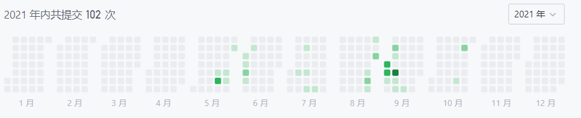
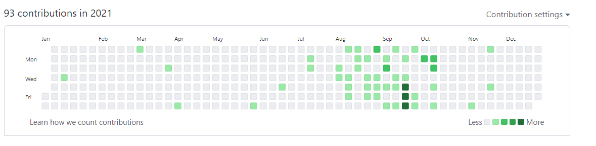
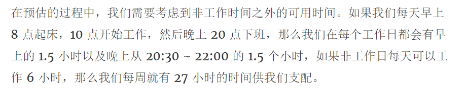
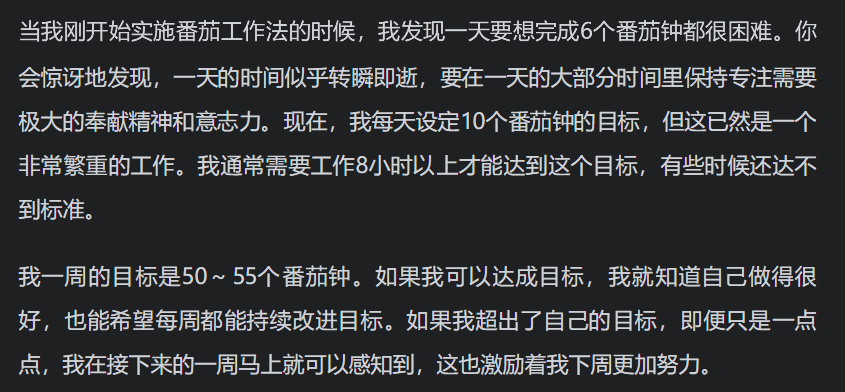

## 2021 总结

1. 我的 21 年关键字是 '纠结'。<!--more-->

   2021 年中工作经验满 1 年。从毕业前后拖拉的在不多的应届生岗位中寻找工作。入职后，虽然工作可以胜任，但是对于自己能力的猜疑让自己一直在纠结中度过，回头看来其实纠结的点都是没有必要。

   2021 从英文世界获取信息的能力大幅提升。自己从头翻译了 Redis 5.0.8 的配置文件 redis.conf，心理上不抗拒加上感受到获取到的信息质量确实有差异后，正反馈明显。

2. 参加 Java 训练营。

   技术上的收获是从更高的维度完善了技术体系的认知；其次是见识到了社群中更多优秀的同学也在不断进步。

3. 拖延。
   关于这篇总结文章，可以看做是 2022 摆脱拖延的开始。此前内心总有许多想法，但都没有真正去执行。比如为自己的职业生涯，技能提升做一个明确的规划并为之努力。

   比如一直想搞定算法，但是都是有一阵没一阵，并没有系统的提高算法能力。能够应付大部分面试的算法部分。内心的想法很多 - 摄影 （极客时间买了摄影课程）、视频（安装过达芬奇 等等剪辑软件）都不了了之。

   LeetCode:

   

   GitHub:

   

4. 收获。
   GitHub + Hexo 搭建了博客，整理了平时的学习笔记发布。

   英文的听读能力有了客观进步。

5. 书籍。

   技术：《Java 8 实战》《Netty 实战》《Java 并发编程的艺术》《Java 并发编程实战》《深入理解 Java 虚拟机 JVM》《第一本 Docker 书》
   其他：《俗世奇人》《软技能：代码之外的生存指南》《你是你吃出来的》《一往无前》《我们唱》《掌控：开启不疲惫、不焦虑的人生》《睡眠革命》《科比：黄金年代》

6. 娱乐。

   1. 推荐剧集：《绝命毒师》1-5 季。
   2. 推荐游戏：《巫师 3 狂猎》。

## 2022 计划

希望 2022 可以比 2021 更加从容，生活工作上都能如此。

1. Object 1：提高技术能力
   1. KR1：丰富博客站内容，增加 30 篇内容。
   2. KR2：完成 5 篇高质量的技术博客。
   3. KR3：参与开源项目，为开源项目提交代码。
2. Object 2：搞定算法，能够应付大部分面试的算法部分。
   1. KR1：分模块进行刷题训练。DP，搜索，贪心 ...
   2. KR2：LeetCode 剑指 Offer 系列题目刷完。

有了大致的目标后，如何分配自己的时间去做也是重点的部分。我目前的做法基于番茄工作法，从《软技能：代码之外的生存指南》中为自己指定了一天 7 个番茄时钟的做法去实践。

[如何管理自己的时间资产](https://draveness.me/few-words-time-management/)

[软技能：代码之外的生存指南](https://book.douban.com/subject/26835090/)

