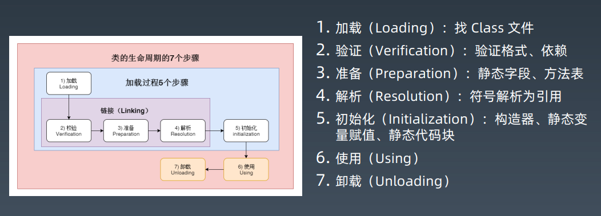
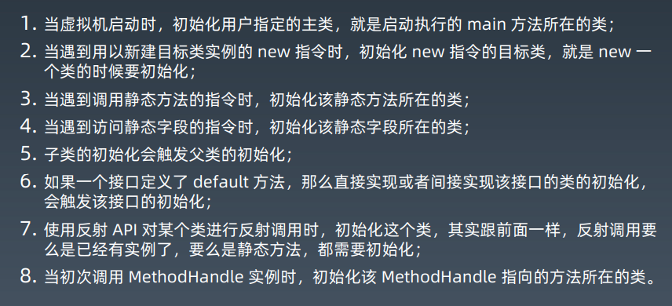
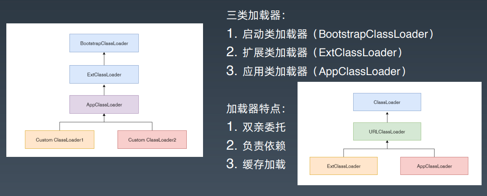
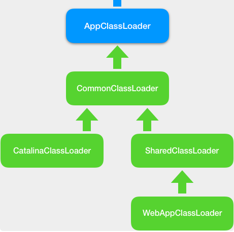

## 概要

此篇文章主要从 3 个部分解析 JVM 的类加载机制：

1. 基础的类加载机制（包括类加载的 7 个步骤、类加载（初始化）的时机以及经典的双亲委派模型）概念开始，辅助以 ClassLoader 的源码进行分析验证双亲委派机制。

2. Tomcat 内部是如何通过**打破双亲委派机制**来实现自己的功能需要。

3. **上下文类加载器**的出现，顶层的类加载器可以通过 ThreadContextClassLoader 来调用下层的加载器来加载类。<!--more-->

## 类加载机制

> Java虚拟机把描述类的数据从Class文件加载到内存，并对数据进行校验、转换解析和初始化，最终形成可以被虚拟机直接使用的Java类型，这个过程被称作虚拟机的类加载机制。
>
> 在 Java 语言里面，类型的加载、连接和初始化过程**都是在程序运行期间完成的**，这种策略让 Java 语言进行提前编译会面临额外的困难，也会让类加载时稍微增加一些性能开销， 但是却为 Java 应用提供了极高的扩展性和灵活性，Java 天生可以动态扩展的语言特性就是依赖运行期动态加载和动态连接这个特点实现的。



### 类加载的时机

> 关于在什么情况下需要开始类加载过程的第一个阶段“加载”，《Java虚拟机规范》中并没有进行 强制约束，这点可以交给虚拟机的具体实现来自由把握。但是对于初始化阶段，《Java虚拟机规范》 则是严格规定了几种必须立即对类进行“初始化”的情况（而加载、验证、准备自然需要在此之前开始）：



### 双亲委派



- BootstrapClassLoader 是启动类加载器，由 C 语言实现，用来加载 JVM 启动时所需要的核心类.这个类加载器负责加载存放在 JAVA_HOME\lib 目录，或者被-Xbootclasspath参数所指定的路径中存放的，而且是Java虚拟机能够 识别的（按照文件名识别，如rt.jar、tools.jar，名字不符合的类库即使放在lib目录中也不会被加载）类 库加载到虚拟机的内存中。

- ExtClassLoader 是扩展类加载器，用来加载 JAVA_HOME\lib\ext 目录下 JAR 包。

- AppClassLoader 是系统类加载器，用来加载 classpath 下的类，应用程序默认用它来加载类。

- 自定义类加载器，用来加载自定义路径下的类。

### ClassLoader  源码分析

```java
public abstract class ClassLoader {

    //每个类加载器都有个父加载器
    private final ClassLoader parent;
    
    public Class<?> loadClass(String name) {
  
        //查找一下这个类是不是已经加载过了
        Class<?> c = findLoadedClass(name);
        
        //如果没有加载过
        if( c == null ){
          //先委托给父加载器去加载，注意这是个递归调用
          if (parent != null) {
              c = parent.loadClass(name);
          }else {
              // 如果父加载器为空，查找Bootstrap加载器是不是加载过了
              c = findBootstrapClassOrNull(name);
          }
        }
        // 如果父加载器没加载成功，调用自己的findClass去加载
        if (c == null) {
            c = findClass(name);
        }
        
        return c；
    }
    
    protected Class<?> findClass(String name){
       //1. 根据传入的类名name，到在特定目录下去寻找类文件，把.class文件读入内存
          ...
       //2. 调用defineClass将字节数组转成Class对象
       return defineClass(buf, off, len)；
    }
    
    // 将字节码数组解析成一个Class对象，用native方法实现
    protected final Class<?> defineClass(byte[] b, int off, int len){
       ...
    }
}
```

从上面的代码我们可以发现，

1. **public loadClass 方法**明显先委托给父加载器先去加载。
2. findClass 方法负责查找 .class 文件
3. defineClass 负责把字节数组解析成一个堆上的 Class 对象

### Tomcat 的类加载器

Tomcat 中的自定义类加载器 WebAppClassLoader 中的实现打破了双亲委派机制。优先加载 Web 应用目录下的类，然后再加载其他目录下的类。

#### loadClass 方法

```java
public Class<?> loadClass(String name, boolean resolve) throws ClassNotFoundException {
    synchronized (getClassLoadingLock(name)) {
        Class<?> clazz = null;
        //1. 先在本地cache查找该类是否已经加载过
        clazz = findLoadedClass0(name);
            return clazz;
        //2. 从系统类加载器的cache中查找是否加载过
        clazz = findLoadedClass(name);
            return clazz;
        // 3. 尝试用ExtClassLoader类加载器类加载，为什么？
        ClassLoader javaseLoader = getJavaseClassLoader();
            clazz = javaseLoader.loadClass(name);
                return clazz;
        // 4. 尝试在本地目录搜索class并加载
            clazz = findClass(name);
                return clazz;
        // 5. 尝试用系统类加载器(也就是AppClassLoader)来加载
            try {
                clazz = Class.forName(name, false, parent);
				return clazz;
            } catch (ClassNotFoundException e) {
                // Ignore
            }
       }
    //6. 上述过程都加载失败，抛出异常
    throw new ClassNotFoundException(name);
}
```

以上代码的第 3 步，让 ExtClassLoader 去加载，一方面可以避免 Web 应用的自己的类覆盖 JRE 核心类；另一方面 AppClassLoader 上一层，因为 AppClassLoader 会加载 ClassPath 下的类（包括了 web path），这样就无法优先加载 web 应用目录下的类。

### Tomcat  类加载机制实现的目的

我们知道，Tomcat 作为 Servlet 容器，它负责加载我们的 Servlet 类，此外它还负责加载 Servlet 所依赖的 JAR 包。并且 Tomcat 本身也是一个 Java 程序，因此它需要加载自己的类和依赖的 JAR 包。

1. 假如我们在 Tomcat 中运行了两个 Web 应用程序，两个 Web 应用中有同名的 Servlet，但是功能不同，Tomcat 需要同时加载和管理这两个同名的 Servlet 类，保证它们不会冲突，因此 Web 应用之间的类需要隔离。

2. 假如两个 Web 应用都依赖同一个第三方的 JAR 包，比如 Spring，那 Spring 的 JAR 包被加载到内存后，Tomcat 要保证这两个 Web 应用能够共享，也就是说 Spring 的 JAR 包只被加载一次，否则随着依赖的第三方 JAR 包增多，JVM 的内存会膨胀。

3. 跟 JVM 一样，我们需要隔离 Tomcat 本身的类和 Web 应用的类。



[25 | Context容器（中）：Tomcat如何隔离Web应用？ (geekbang.org)](https://time.geekbang.org/column/article/105711?utm_source=u_nav_web&utm_medium=u_nav_web&utm_term=u_nav_web)

### 上下文类加载器


## 参考链接

1. [Tomcat如何隔离Web应用？ (geekbang.org)](https://time.geekbang.org/column/article/105711?utm_source=u_nav_web&utm_medium=u_nav_web&utm_term=u_nav_web)
2. 《深入理解 Java 虚拟机》