# 锁

## Lock 接口

Java 1.5 之后，并发包新增了 Lock 接口以及相关实现类来提供更丰富的锁功能。synchronized 同步块虽然使用上很便携，但是可操作性比较欠缺<!--more-->。通过引入 Lock ，程序员可以手动获取锁，释放锁，**超时获取锁，非阻塞获取锁，响应中断**等等。

基于 Lock 接口，提供了许多好用的实现类。

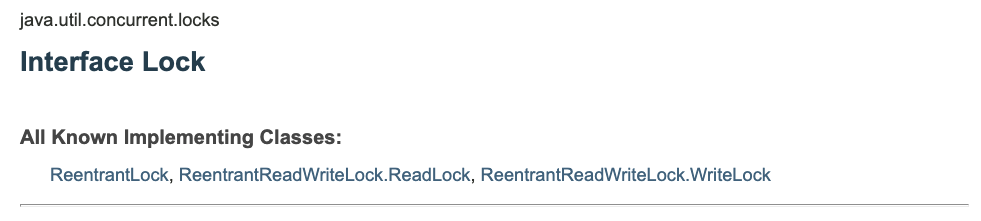

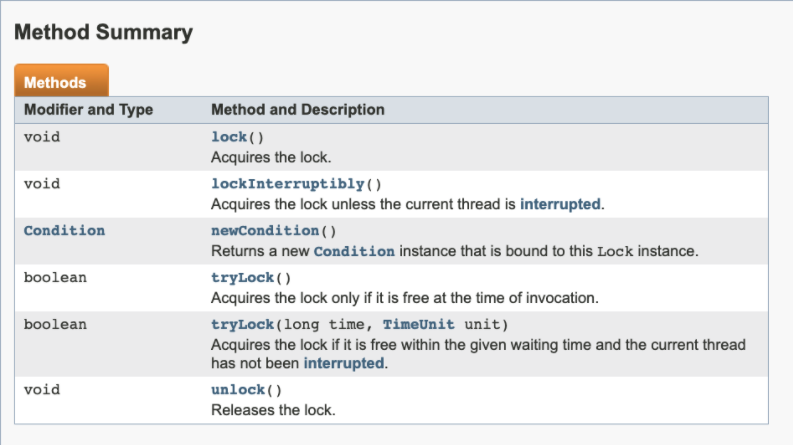

## AQS

AbstractQueuedSynchronizer - 队列同步器，许多 Lock 的实现类都是基于这个基础组件来实现资源的访问控制的。

AQS 是基于模板方法模式设计的，想要实现同步组件，我们可以继承 AQS，重写对应的方法，然后调用 AQS 提供的模板方法来使用。

### 使用同步组件

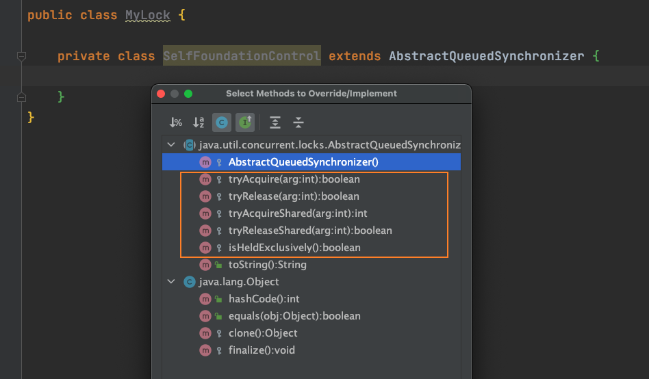

可以看到 5 个可由我们重写的方法（这些资源就是 AQS 里面的 state 基础变量）：

- 尝试获取内部的资源
- 释放资源
- 尝试获取共享资源
- 释放共享资源
- 是否是独占模式

一般我们将该实现类放到内部，然后暴露给外部使用的方法中调用这些方法来进行控制。

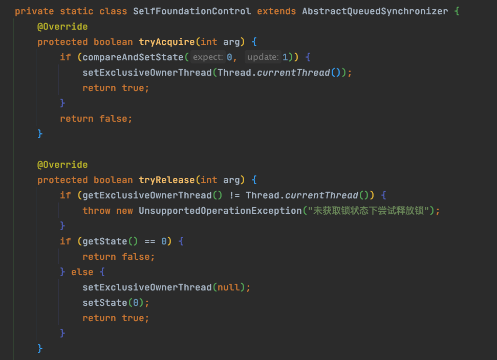

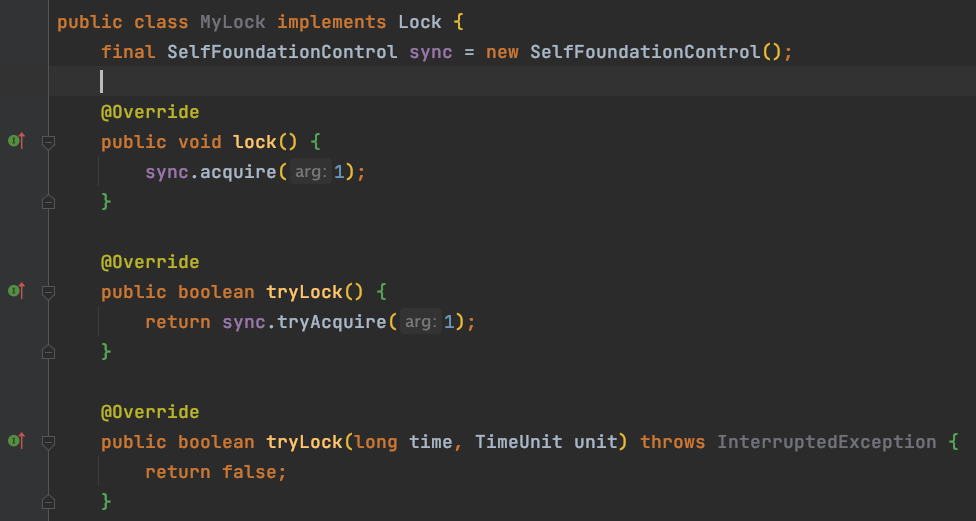

暴露出来的方法，比如 tryLock() 内部调用我们重写的 tryAcquire 方法。内部的 tryAcquire() 方法实现，核心是围绕着 **state** 进行资源控制的。主要通过这 3 个方法:

1. getState()
2. setState()
3. compareAndSetState()

上面的这个简单实现表示，如果state == 0，表示没有线程占用，我们用 cas 成功后，当前线程则获取到锁。state此时 == 1。

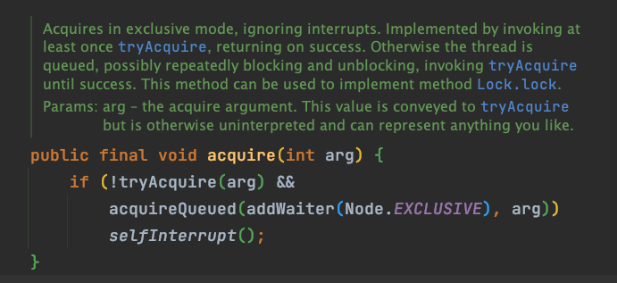

MyLock 实现 Lock 接口，通过内部类实现 AQS，进行资源控制。lock() 方法则是直接调用 AQS 提供的**模板方法 acquire()**，先是 tryAcquire() 不行的话就去排队。

## ReentrantLock

可重入锁。它支持同一个线程对同步资源重复加锁（释放锁也需要调用对应次数 unlock())。

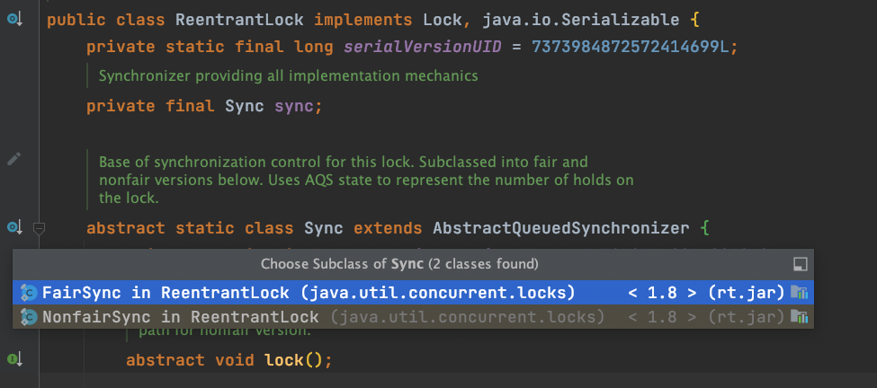

ReentrantLock 提供了公平锁和非公平锁，公平的指的是排队等待锁的线程获取锁是否公平。公平的话，当锁可获取时，等待最久的线程优先获取锁。不公平就是无法保证。非公平的锁性能一般高些（线程切换，同一个线程重复占用）。

### ReentrantLock 的内部 AQS 实现类（基于默认的 NonFairSync）

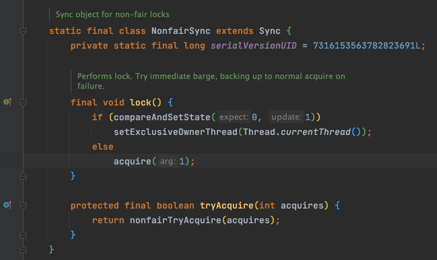

1. NonfairSync#lock()。cas 获取 state，
   1. 设置成功拿到锁，设置独占线程。
   2. 失败，调用 acquire（AQS 的实现），将会先调用 tryAcquire() 尝试获取，不行的话就去排队。
2. tryAcquire() 直接调用父类的 nonfiarTryAcquire() 实现，实现如下。

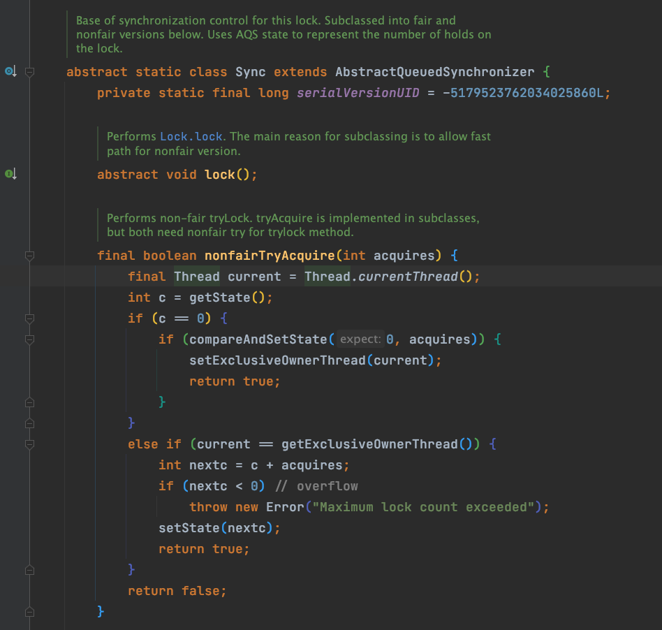

3. 公平锁的 tryAcruire() 实现，在判断 c == 0 后，设置同步位的时候调用 hasQueuedPredecessors() 一起判断。该方法的注释如下。

   

4. Sync#nonfairTryAquire

   - getState() 判断资源占用状态
   - == 0，这一时刻咩有线程占用，cas 尝试设置状态 ->
     - 成功，return ture，获取锁成功。
     - 失败，return false，tryacquire 失败。
   - != 0，表示资源被线程持有，判断是不是当前线程 ->
     - 是的话，**说明是重复加锁（可重入）**，锁状态 state 叠加后 setState() 设置
     - 不是的话，说明已有线程独占，获取失败。

## ReentrantReadWriteLock

# 并发工具

## Condition 接口

通过 Lock.newCondition() ，相当于进一步的通信协作。可以 new 多个 Conditions 出来。

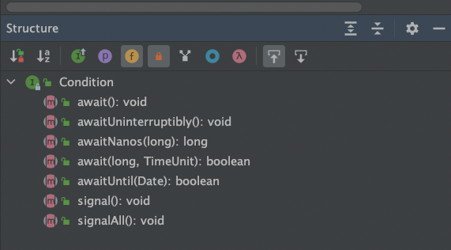

## LockSupport

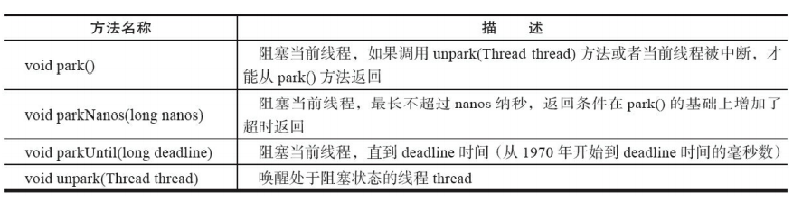

Java 6 加入 part/parkNanos/parkUntil(Ojbeck blocker,long nanos,long dendlin)。

unpark() 方法传入一个 thread 参数，唤醒线程要让其他线程来。

对象 blocker 的作用，大致是方便诊断工具，为我们提供更多信息。

[java - What is the usage of the parameter of LockSupport.park(Object blocker)? - Stack Overflow](https://stackoverflow.com/questions/36939218/what-is-the-usage-of-the-parameter-of-locksupport-parkobject-blocker)

## Semaphore

线程通过调用 acquire() 获取信号量 permit，permit - 1 > 0，则表示成功，线程可以继续往下执行；否则等待。

线程通过调用 releasse() 释放 permit，permit + 1。

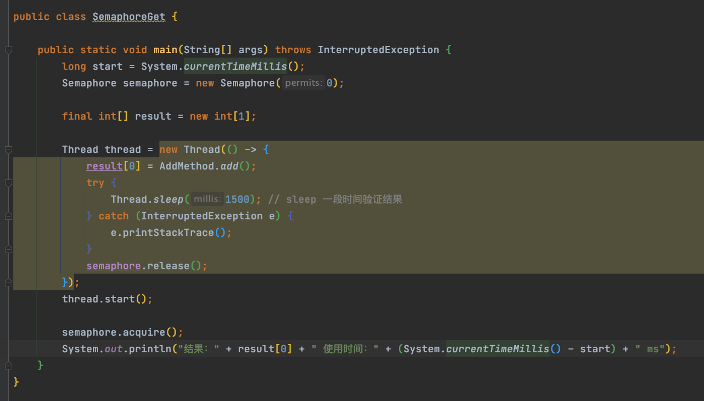

## CountDawnLatch

线程等待（调用 await() 方法）,其他线程通过 countDown() 方法减少计数，变成 0 后，等待的那个线程继续往下执行。

不能重复使用。

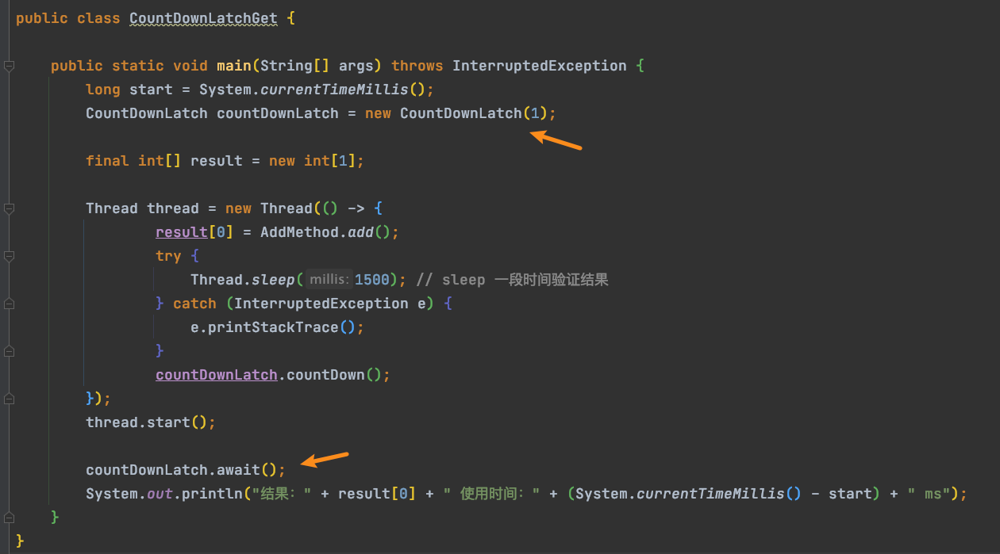

## CyclicBarrier

循环屏障，线程到达屏障（await() 方法），停下来等待，达到定义的数量后，一起放行所有被拦住的线程，继续往下执行。

CyclicBarrier 可以重复使用。且可提供一个回调方法，由最后一个到达且触发放行的线程执行。

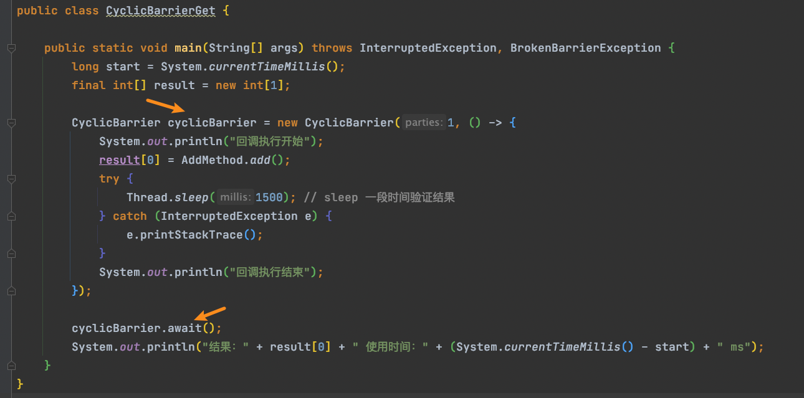

## ThreadLocal

## parallel stream

## Future CompleteableFuture

# 并发原子类

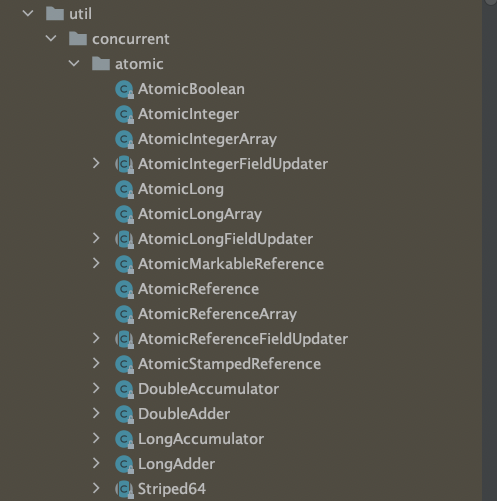

并发原子类的核心原理：

1. volatile 
2. cas、自旋

无锁和有锁在不同并发程度下的性能差异：

1. 压力小，有锁无锁都没关系，本身压力小。
2. 压力一般，无锁一次写入成功的概率高，性能高些。
3. 压力大，自旋导致 cpu 消耗大，性能差些。

# 并发容器

