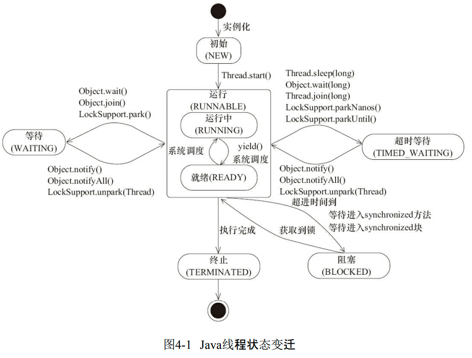

# 可见性、有序性和原子性

## 可见性

多核 CPU ，每个 CPU 都有属于自己的多层缓存可以提高访问数据的速度以及减少共享内存的竞争。多核 CPU，每个线程对共享变量都可能通过缓存来访问，**不同线程之间对共享变量的修改是否立即可见（刷新到主存并且更新缓存），一般称为可见性。**<!--more-->

## 有序性

编译器和处理器为了优化性能对**指令进行重排序导致的有序性问题**。比如我们常见的 new 一个对象的操作。我们以为的顺序应该是：

1. 分配一块内存
2. 在该内存上初始化对象
3. 将该内存的地址赋值在对象变量

但是有优化后的顺序可能是这样的：

1. 分配一块内存
2. 将该内存的地址赋值给对象变量
3. 再在该内存上初始化对象

以上的重排序问题可以导致 Double-Check 创建单例模式的时候出现问题。为了避免这个问题，需要使用 volatile 定义变量来避免重排序。

编译器和处理器会对指令进行重排序，**不会影响到单核处理和单线程处理情况的语义正确性**，**但不保证在多线程环境下的正确性。**

## 原子性

原子性是指一个操作是不可中断的。在多线程环境中，一个线程在执行某个原子性的逻辑时，不会被干扰。

Java 并发程序在执行时，是可能发生线程切换的，线程切换可能发生在**任一 CPU 指令之间，而不是我们在高级语言层面看到所认为的。**最常见的自增操作 i++ 在 CPU 层面可以分成 3 步操作：

1. 将 i 的值从内存中加载到 CPU 寄存器
2. 执行 i + 1 的操作
3. 写回内存（可能是 CPU 缓存）。

线程切换可能发生在我们直觉上认为应该是一个整体的操作，这也是导致并发问题的原因之一。

# 如何解决这些问题？

我们知道可见性问题是因为缓存，有序性是因为重排序。那想要解决这两个问题最粗暴的思路就是禁用缓存和指令重排序优化（cpu 和编译器），这样应用程序相当于放弃了这些优化技术发展带来的性能优势。

我们的程序并不是所有的地方都有上面说的问题，所以可以按需禁用缓存以及编译优化。

## Java 内存模型

The Java Memory Model describes what behaviors are legal in multithreaded code, and how threads may interact through memory. It describes the relationship between variables in a program and the low-level details of **storing and retrieving them to and from memory** or registers in a real computer system. **It does this in a way that can be implemented correctly using a wide variety of hardware** and a wide variety of **compiler optimizations.**

JMM 围绕带来线程安全问题的有序性和可见性问题，**规范了 JVM 为我们提供避免这些问题的基本实现规则。**

站在程序员的角度来说，JMM 为我们提供了 volatile，synchronized 和 final 关键字，以及 6 个和我们有关的 Happens-Before 规则。

* [https://www.cs.umd.edu/~pugh/java/memoryModel/jsr-133-faq.html](https://www.cs.umd.edu/~pugh/java/memoryModel/jsr-133-faq.html)，JSR-133 FAQ
* [http://gee.cs.oswego.edu/dl/cpj/jmm.html](http://gee.cs.oswego.edu/dl/cpj/jmm.html)，Conucrrent Programming in Java，Doug Lea

## volatile

使用 volatile 关键字声明变量，表示对这个变量的读写，禁用 CPU 缓存，避免可见性问题。volatile 在 1.5 前后有语义增强，通过 Happens-Before 规则确保。

## final 关键字

final 关键字的意思是表示被修饰的内容的整个生命周期内容都不改变，相当于天然的并发安全，且可以被尽力的优化。

 final 关键字修饰的内容在 1.5 以前可能导致线程看到的 final 变量值发现变化。
[www.cs.umd.edu/~pugh/java/memoryModel/jsr-133-faq.html#finalWrong](http://www.cs.umd.edu/~pugh/java/memoryModel/jsr-133-faq.html#finalWrong)

现在的 JMM 程序只需要保证构造函数没有 this 逸出就不会出现问题。

## Happens-before Order

Two actions can be ordered by a happens-before relationship. If one action happens-before another, **then the first is visible to and ordered before the second**.
**（前面的操作结果对后续的操作是可见的）**

JDK 1.5 开始，Java 采用了新的内存模型。新的内存模型引入了 Happens-before 规则来说明操作之间的可见性。比如下面两个写操作，操作 A 的结果在操作 B 的时候是可见的。

```plain
x = 55;
volatileVar = 66;
```

同样的，站在程序员的角度，happens-before 规则对我们理解并发有关的规则有以下几条：

* **程序的顺序性规则；一个线程中的每个操作，都 happens-before 于后续的操作。**
* **volatile 变量的规则：对于一个 volatile 变量的写，happens-before 于后续对这个变量的读。**
* **传递性：A happens-before B，B happens-before C，那么 A happens-before C。**
* **对一个锁的解锁 happens-before 与后续对这个锁的加锁。**
* **对线程调用 start(）的操作 happens-before 于在被调用了 start(）线程中的任何操作。**
* **线程调用其他线程的 join() 方法，其他线程成功返回后，其他线程中的操作 happens-before 线程后续的操作。**

[https://docs.oracle.com/javase/specs/jls/se7/html/jls-17.html#jls-17.4](https://docs.oracle.com/javase/specs/jls/se7/html/jls-17.html#jls-17.4)

[Java内存模型FAQ | 并发编程网 – ifeve.com](http://ifeve.com/jmm-faq/)

# 锁

前面提到的原子性问题，在于线程切换，在多核 CPU 时代，我们必须保证**同一个时刻只有一个线程**在操作（32 位机器上写 long 变量，单纯的禁止线程切换对多核不好使）。

## 互斥锁模型


**资源与锁 1 对 1，每个锁都有自己的锁资源的对象。**

## synchronized 关键字

synchronized 可以修饰普通方法、静态方法、和代码块，要注意这三种方式锁的资源不同。

```java
public class Sync {
  synchronized static void foo();
  
  synchronized void bar();
  
  void block(){
    synchronized (obj){
    
    }
  }
}
```


# Java 线程

## Runnable 接口

顶层基础接口，实现 run 方法，定义线程启动后执行的任务。

```java
public interface Runnable {
  public abstract void run();
}
```


## Thread 类

Thread 类实现了 Runnable 接口。
通过调用 Thread#start() 来创建新线程并执行任务。
调用 Thread#run() 则是调用这个方法的线程执行 run 方法。


## 线程的生命周期

### 操作系统层面的线程生命周期

.png)

* 初始状态：刚创建
* 可运行状态：可以分配 CPU 执行，等待分配 CPU 
* 运行状态：获得 CPU，正在执行
* 休眠状态：阻塞，等待特定事件完成，进入可运行状态
* 终止状态：执行完成或者发生异常

### Java 线程的生命周期

.png)

###  线程状态直接的变化





### LOCKSUPPORT  TODO


# wait-notify 机制

在程序中，线程进入临界区后，因为某些条件不满足，可以使用 wait() 方法进入等待状态。调用 wait() 后，该线程被阻塞，进入该**互斥锁的等待队列中且释放持有的锁**。（这里的等待队列和锁竞争队列不一样。）

当线程要求的条件满足时，可以调用 notify() 和 notifyAll() 方法通知等待队列中的线程，**条件满足过**。**这里注意调用 notify() 通知等待线程满足条件与线程再执行到条件判断的时间点是不同的，这期间条件可能又不满足。**针对这种情况已经有了经典的做法：

```plain
while(条件不满足) {
  wait();
}
```

通过 while 来不断检验条件的满足情况。
要注意调用 wait()、notify()、notifyAll() **操作的对象是互斥锁的等待队列**。也就是说调用这几个方法的当前线程肯定是**已经持有了这个锁**才能调用，否则会抛出IllegalMonitorStateException 异常。

.png)


### notify() 与 notifyAll() 的区别

在调用了 wait() 后，当前线程会释放持有的锁，并进入**等待队列。**

之后，当其他线程调用了 notify() 时，只会 wake **等待队列中**的一个线程，该线程随之进入**互斥锁的竞争队列竞争锁**，然后在调用 wait() 后的位置继续执行；

如果调用的是 notifyAll()，则会 weak 所有等待队列中的线程，进入锁竞争队列竞争锁。

### Thread.sleep() 和 Object.wait() 的区别

调用 sleep() 会将当前线程挂起，操作系统层面会让出 CPU，当前线程不会释放持有的锁。

wait() 方法属于 Object 类。调用 wait() 方法会释放持有的锁，线程进入等待队列，等待 notify(）唤醒后在 wait() 后继续执行。

调用 wait() 必须在同步块中，要保证获取到锁才能调用。

### stop() 和 interrupt() 的区别

stop() 方法直接杀死线程，被 stop() 的线程可能没有机会释放锁。

interrupt() 方法会通知线程（**根据被中断线程的状态有不同的反应**）

* A 处于WAITING、TIME_WAITING，其他线程调用 A 的 interrupt() 方法，线程 A 会返回到 RUNNABLE 状态，同时线程 A 触发 InterruptedException 异常。
* A 处于 RUNNABLE 状态，并阻塞在以下两种情况，当其他线程调用 A 的 interrupt(） 方法时：
  *  java.nio.channels.InterruptibleChannel，**线程 A 会触发 java.nio.channels.ClosedByInterruptException 这个异常。**
  *  java.nio.channels.Selector ，**线程 A 的 java.nio.channels.Selector 会立即返回。**


需要注意抛出异常后，中断标识会自己清除。通过 Thread#isInterrupted() 重置成 false。

# 相关链接 


1. [https://www.cs.umd.edu/~pugh/java/memoryModel/jsr-133-faq.html](https://www.cs.umd.edu/~pugh/java/memoryModel/jsr-133-faq.html)，JSR-133 FAQ
2. [Java内存模型FAQ | 并发编程网 – ifeve.com](http://ifeve.com/jmm-faq/)
3. [Java并发编程实战 (geekbang.org)](https://time.geekbang.org/column/intro/100023901?utm_source=u_nav_web&utm_medium=u_nav_web&utm_term=u_nav_web&tab=catalog)
4. [https://docs.oracle.com/javase/specs/jls/se7/html/jls-17.html#jls-17.4](https://docs.oracle.com/javase/specs/jls/se7/html/jls-17.html#jls-17.4)

5. [http://gee.cs.oswego.edu/dl/cpj/jmm.html](http://gee.cs.oswego.edu/dl/cpj/jmm.html)，Conucrrent Programming in Java，Doug Lea

6. 《Java 并发编程的艺术》