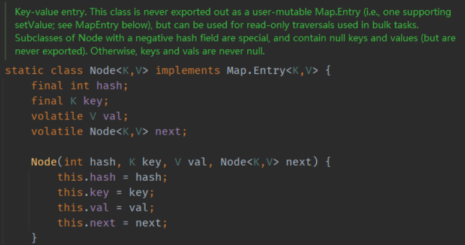
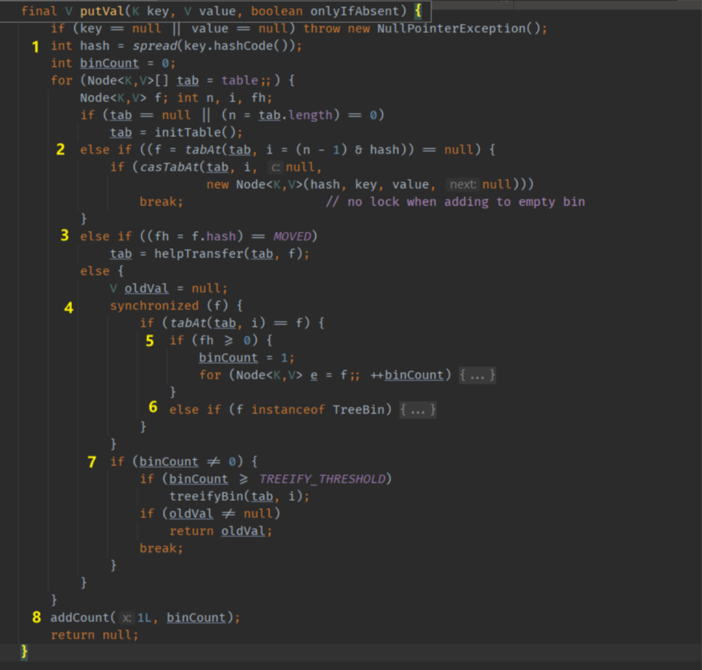
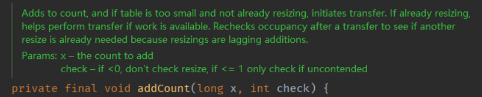
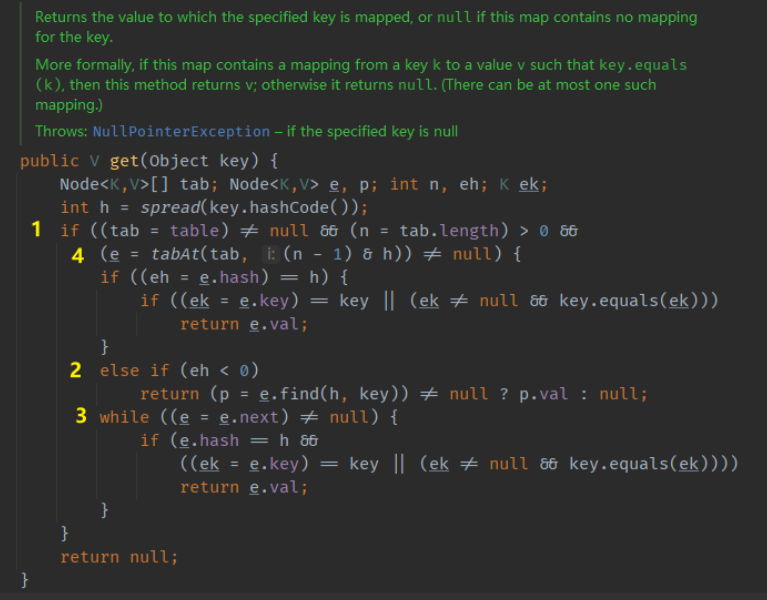
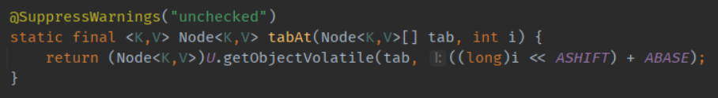
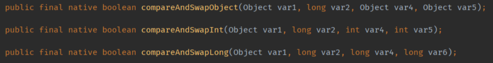
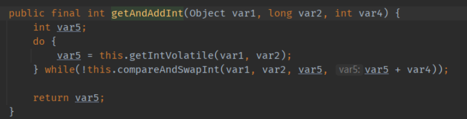

# 简介

ConcurrentHashMap 是高性能的线程安全的哈希容器。

值得一提的是 ConcurrentHashMap 的 key 和 value 不允许 null 值。

Doug Lea 和 Josh Bloch 对 HashMap，ConcurrentHashMap key 允不允许 null 值的讨论。

* [http://cs.oswego.edu/pipermail/concurrency-interest/2006-May/002485.html](http://cs.oswego.edu/pipermail/concurrency-interest/2006-May/002485.html?fileGuid=Hxch6t3HxHCRkVqG)

* [http://cs.oswego.edu/pipermail/concurrency-interest/2006-May/002486.html](http://cs.oswego.edu/pipermail/concurrency-interest/2006-May/002486.html?fileGuid=Hxch6t3HxHCRkVqG)

  <!--more-->

邮件里大致的内容说明是因为 null 值有二义性。在并发环境下，如果你通过 get(key) 得到了一个 null 值，无法判断是因为 map 中不存在这个 key 还是因为 key 对应的 value 是 null。在并发环境下，你无法通过调用 containsKey() 来确定。

因为不允许 null 值，所以在 ConcurrentHashMap 中，可以通过 get() 是否为 null 来直接判断是否 contains 一个 key。

# 源码分析

## 存储结构

JDK 1.8 之后，采用的存储结构与 HashMap 一样，Node<K,V>[] table。不同的是 Node 中的 val 和 next 用**volatile**来修饰，用于保证可见性。

## put() 方法

1. rehash，保证均匀分布

2. 索引定位后，如果该槽上没有值，通过 CAS 更新。这里的 tabAt，casTabAt 需要利用到 volatile 的可见性来保证正确。

3. 表正在扩容

4. 都不满足，对索引定位到的槽加锁操作。

5. 槽节点的 hash 值大等 0，说明该槽上不是红黑树。按照拉链法的方式来插入值。

6. 槽根节点的 hash 值小于 0，说明是树节点，走红黑树的插入逻辑。

7. 插入后，判断阈值来进行树化。

   

JDK 1.8 之后，利用了 CAS+synchronized，相比于 1.7 的锁定 Segment 的方式，取消了ReentrantLock 使用synchronized（看来 1.8 对于 synchronized 的优化很可观。网上的资源提到 synchronized 的锁升级，其实在 1.6 就已经引入），优化了锁的粒度和使用。

## get() 方法

get 方法相对比较简单，因为使用了**volatile**修饰 val 和 next 变量，get 的时候可以无锁操作。

1. 索引定位哈希槽的位置上是否有值，没有的话直接返回 null。有的话，比较哈希槽上根节点的 key ，一致的话直接返回 val 值。

2. 哈希槽根节点的 hash 值小于 0 ，说明是红黑树，走红黑树的查找方法。

3. 都不满足的话，在链表中往下遍历查找。

# 硬件同步原语 CAS

硬件同步原语是由计算机硬件提供的一组原子操作，具体来说就是 CPU 提供的实现，可以保证指令操作的原子性。

CAS（Compare and Swap）的意思是，先获取某个想要修改的旧值，然后在修改的时候，比较当前的值和旧值，如果一致，就更新为新的，返回 true。否则就不改变，返回 false。

还有一个常用的 FAA（Fetch and Add），的作用是获取某个变量的值，然后将变量的值增加，然后返回旧值。

在各种高级编程语言中，这些原语一般都有相应的实现。

比如 JDK 中提供的 CAS 。

Java 中的 FAA 好像是通过 CAS 实现的。

### 

### CAS 的 ABA 问题

CAS 在写入时仅仅判断当前值和旧值，期间值可能改变过，但是无法判断。Java 提供了[AtomicStampedReference](http://tutorials.jenkov.com/java-util-concurrent/atomicstampedreference.html?fileGuid=Hxch6t3HxHCRkVqG)工具类，通过版本号的方式来完善这个问题。

### CAS 的开销和优点

使用 CAS 可以避免使用锁，减小开销。但是 CAS 面对频繁的资源竞争的话，一直反复采用 CAS 尝试更新失败概率高，CPU 的开销也随之变大。

CAS 像是乐观锁的思路，总认为修改成功的概率很高。悲观锁的思路就是共享资源的竞争可能很频繁，就采用独占的方式操作，比如  synchronized 关键字。

# 注意事项

ConcurrentHashMap 是高性能的线程安全的容器，但并不意味着使用它就没有安全问题。比如其 size() ，putALL() 等方法在并发情况下只能反映中间情况。

使用 ConcurrentHashMap 的时候，对其的多个操作之间仍然不是原子性的，如果需要的话可以对 map 加锁操作。

# 总结

ConcurrentHashMap 在 1.7 之前采用分段锁的形式，默认并发 16，取决于 Segment。1.8 之后的存储结构和 HashMap 类似，且采用 CAS + synchronized 来保证原子性的读写操作。

使用 ConcurrentHashMap 、CopyOnWriteArrayList 等线程安全的工具类，并不意味着就没有线程安全问题，有关并发安全的知识则需要自己学习运用。

# 相关链接

1. [https://docs.oracle.com/javase/8/docs/api/java/util/concurrent/ConcurrentHashMap.html](https://docs.oracle.com/javase/8/docs/api/java/util/concurrent/ConcurrentHashMap.html?fileGuid=Hxch6t3HxHCRkVqG)，ConcurrentHashMap 官方文档
2. [http://tutorials.jenkov.com/java-util-concurrent/atomicstampedreference.html](http://tutorials.jenkov.com/java-util-concurrent/atomicstampedreference.html?fileGuid=Hxch6t3HxHCRkVqG)，AtomicStampedReference 使用教程
3. [https://en.wikipedia.org/wiki/Compare-and-swap](https://en.wikipedia.org/wiki/Compare-and-swap?fileGuid=Hxch6t3HxHCRkVqG)，CAS 原语