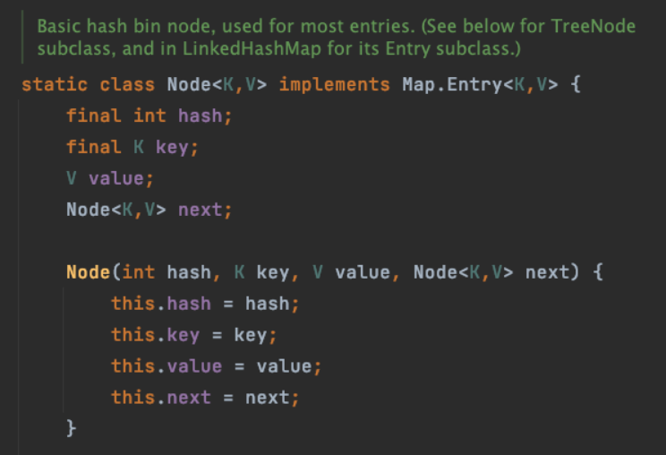
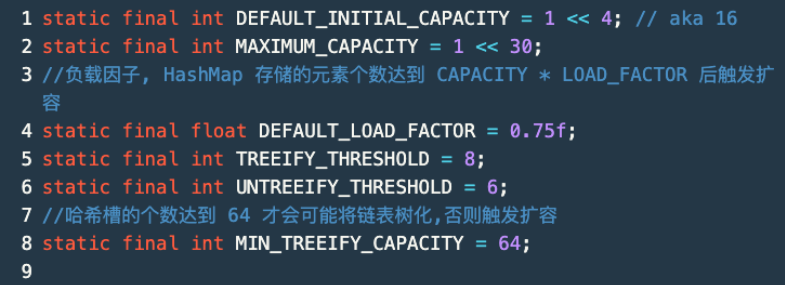
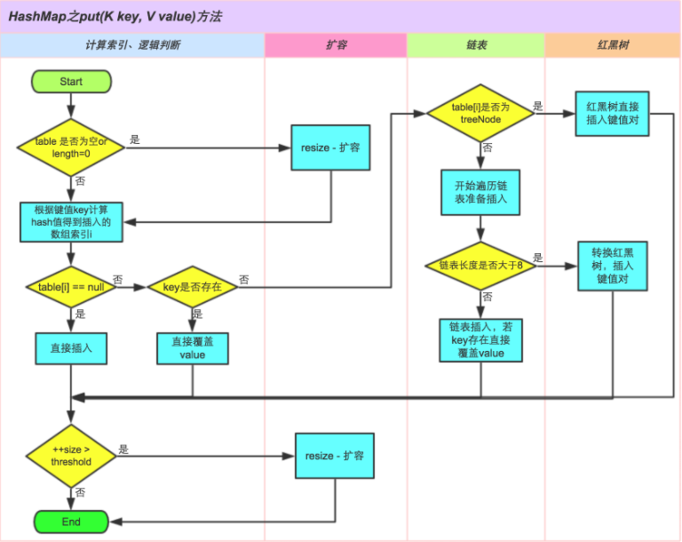
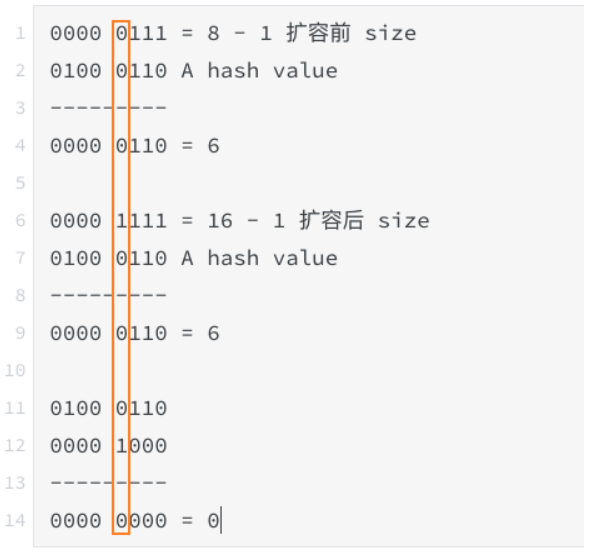

# 简介

## 哈希算法

哈希算法的作用是：对于输入的数据，输出**固定长度**的数据摘要。

哈希算法的特点：<!--more-->

1. 同一个输入，输出的哈希值一定是一致的。
2. 不同输入，哪怕是一个 Bit 的差别，得到的哈希值有明显的差别。
3. 对于不同的输入，是有可能得到相同的哈希值的。这种情况一般也称作哈希碰撞。原因很简单，因为计算得到的哈希值是固定长度的，总量有限制。而输入的值可能是无限的。

一个优秀的哈希算法至少得满足两点：

1. 计算哈希值的速度很快。
2. 出现哈希碰撞的概率很低。

哈希算法的实际应用场景很多，常见的有这几种：

1. 数据加密。符合的点有两个：很难根据哈希值反推出原始数据；哈希冲突的概率低；
2. 数据校验。校验文件的完整性。
3. 哈希表。

对于业务上保存用户的密码，有一些思路顺便记录一下。

* hash + 随机 salt。
* 采用计算时间慢的算法来降低硬件计算的速度。
* 不规律的计算时间，避免得到与密码有关的联系的信息，比如字符串的长度信息。
* 时序攻击：[https://www.zhihu.com/question/20156213](https://www.zhihu.com/question/20156213?fileGuid=9CXxDy6PxXx6yDVH)。

## HashMap

HashMap 根据 key 的 hashCode 值，寻找对应的位置保存数据。在没有哈希冲突的前提下，可以通过 O(1) 的时间复杂度定位到的 key。

Java 的 HashMap 通过额外链表法来解决哈希冲突的问题。在 Java 1.8 之后，如果某个哈希槽上的链表元素个数超过了 TREEIFY_THRESHOLD ，会将链表树化为红黑树，进一步提高性能。

# 源码分析

## 存储结构

HashMap 类中的字段 Node<K,V>[] table，即使用 Node<K,V> 数组来存储数据。

Node<K,V> 中有一个 Node<K,V> next 字段，当某个哈希槽上已经存储了数据，next 就用来在该哈希槽上拉出链表来解决哈希冲突。

HashMap 的默认字段定义

## 

## hash(Object key) 方法

```plain
public V put(K key, V value) {
return putVal(hash(key), key, value, false, true);
}
static final int hash(Object key) {
    int h;
    return (key == null) ? 0 : (h = key.hashCode()) ^ (h >>> 16);
}
```

不管是在 put 或者 get，都会先通过 hash(key) ，根据 key 的 hashCode 重新计算一个 hash 值用于索引定位。
事先通过 hash(key) 将 key 的 hashCode 重新散列，将 hashCode 的高位向右移 16 位，异或计算后得到的 hash 值进行索引定位（否则这些高位可能由于 (table.length -1) & hash 的取模方式永远参与不到取模的运算中，取模运算的结果其实就是 hash 中对应的后几位的值）。

## 索引定位方式

HashMap 的源码定位哈希槽的位置的方式是通过位运算计算哈希槽的位置，具体的计算方式是：**(table.length - 1) & hash**。

由于 table.length 在初始化或者扩容后总是**取 2 的某个幂次方数**，在将其减去 1 之后，二进制的低位上数据都是 1，再于 hash 进行 & 运算，将计算后的值限制在 table.length 内。相当于高效率的 % 运算。

## 插入方法



(图来自美团技术团队博客)

## 扩容机制

HashMap 扩容默认是原始容量的两倍。

```java
final Node<K,V>[] resize() {
    Node<K,V>[] oldTab = table;
    int oldCap = (oldTab == null) ? 0 : oldTab.length;
    int oldThr = threshold;
    int newCap, newThr = 0;
    if (oldCap > 0) {
        // 超过最大容量，随你碰撞好了
        if (oldCap >= MAXIMUM_CAPACITY) {
            threshold = Integer.MAX_VALUE;
            return oldTab;
        }
        // oldCap 向左移动一位，newCap = 2 *oldCap 
        else if ((newCap = oldCap << 1) < MAXIMUM_CAPACITY &&
                 oldCap >= DEFAULT_INITIAL_CAPACITY)
            newThr = oldThr << 1; // double threshold
    }
    ...
    @SuppressWarnings({"rawtypes","unchecked"})
    Node<K,V>[] newTab = (Node<K,V>[])new Node[newCap];
    table = newTab;
    //数据重新进行索引定位
    if (oldTab != null) {
        for (int j = 0; j < oldCap; ++j) {
            Node<K,V> e;
            if ((e = oldTab[j]) != null) {
                oldTab[j] = null;
                // 该哈希槽上没有哈希冲突，重新索引定位位置存储
                if (e.next == null) 
                    newTab[e.hash & (newCap - 1)] = e;
                // 该哈希槽上的节点是 TreeNode，
                else if (e instanceof TreeNode)
                    ((TreeNode<K,V>)e).split(this, newTab, j, oldCap);
                // 该哈希槽上的节点存在哈希冲突保存的其他元素
                else { // 链表数据重新定位
                    // loHead,loTail 的含义是重新进行索引定位后仍在原哈希槽位置上的节点和链表节点元素。比如 e = oldTab[j]，重新索引定位后，newTab[j] = e;
                    Node<K,V> loHead = null, loTail = null;
                    // hiHead,hiTail 的含义是重新进行索引定位后的节点和链表节点元素在 j + oldCap 上。比如 e = oldTab[j]，重新索引定位后，newTab[j + oldCap] = e;
                    Node<K,V> hiHead = null, hiTail = null;
                    Node<K,V> next;
                    do {
                        next = e.next;
                        //计算哈希值的高一位是 0 还是 1
                        if ((e.hash & oldCap) == 0) { // 为 0
                            if (loTail == null)
                                loHead = e;
                            else
                                loTail.next = e;
                            loTail = e;
                        }
                        else { // 高一位为 1
                            if (hiTail == null)
                                hiHead = e;
                            else
                                hiTail.next = e;
                            hiTail = e;
                        }
                    } while ((e = next) != null);
                    if (loTail != null) {
                        loTail.next = null;
                        // 高一位为 0 时，元素的存储位置数组下标没有变化
                        newTab[j] = loHead;
                    }
                    if (hiTail != null) {
                        hiTail.next = null;
                        // 为 1，元素存储位置为 旧数组下标 + 原容量 。
                        newTab[j + oldCap] = hiHead;
                    }
                }
            }
        }
    }
    return newTab;
}
```

重点看一下 43 行对链表的 rehash 操作。代码为什么通过 (e.hash & oldCap) == 0 || != 0 就可以判断元素经过 rehash 后在新哈希桶中的位置。
因为 HashMap 的索引定位方式是 (table.length - 1) & hash ，且扩容之后的容量是原容量的 2 倍。索引定位方式舍弃了 table.length 的那个高位 1，经过扩容后，rehash 的索引定位方式相比于原来的只需要计算之前舍弃的那个高位 1 就可以确实位置。**这样在扩容时重新定位元素时巧妙的避免了重新计算 hash(key) 值。**

举个例子，HashMap 的大小是 8 , 插入元素的时候触发了扩容，扩容后的大小是 16。

有一个 key A 经过 hash(key) 后的 hash 值是 0100 0110。

11-14 行计算的是 k.hash & oldCap，即如果结果是 0，说明 key A 的存储位置还是在 [6] 中。如果不为 0，说明第四位是 1，那么第 9 行的结果应该是 0000 1110 = 14 , 就是 j + oldCap 的位置。

## hashCode() 与 equals() 方法

重写了 equals() 方法，没有重写 hashCode() 方法。当我们用该对象作为 key 时，且业务上有 "逻辑相等" 的概念时，可能会导致预期外的行为。没有重写 hashCode() 方法的话，会使用 Object#hashCode() 方法，该方法生成的哈希值无法提供 "逻辑相同" 的概念。

# 总结

1. 使用 HashMap 存储时，如果有 "逻辑相等" 的概念，需要同时重写 hashCode() 方法。
2. 在初始化的时候根据需求给定一个合适的大小，避免频繁扩容。
3. HashMap 不是线程安全的容器，JDK 1.7 之前的实现并发使用在扩容搬移时可能出现 "无限循环" bug。
4. 线程安全的类似 HashMap 有 Hashtable 和 ConcurrentHashMap 可以使用。

# 参考链接

1. [https://tech.meituan.com/2016/06/24/java-hashmap.html](https://tech.meituan.com/2016/06/24/java-hashmap.html?fileGuid=9CXxDy6PxXx6yDVH)，美团技术团队博客
2. [https://en.wikipedia.org/wiki/Timing_attack](https://en.wikipedia.org/wiki/Timing_attack?fileGuid=9CXxDy6PxXx6yDVH)，时序攻击
3. [https://en.wikipedia.org/wiki/Hash_function](https://en.wikipedia.org/wiki/Hash_function?fileGuid=9CXxDy6PxXx6yDVH)，哈希函数