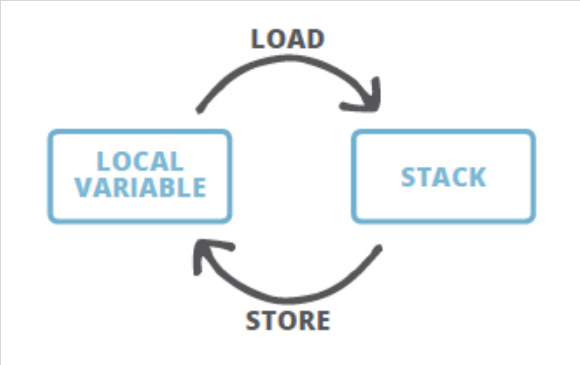

Java 字节码由 byte 组成，理论上可以支持 2^8 个操作码，实际中 Java 只用到了 200 个左右的操作码。

在 JVM 执行过程中，每个线程都有私有的线程栈，线程执行程序时每一次方法调用都会创建一个 **栈帧**。栈帧由操作数栈、局部变量数组和 [Frame Data](https://www.artima.com/insidejvm/ed2/jvm8.html) 组成。<!--more-->

### 源码

```java
package com.training.advanced.jvm;

/**
 * 字节码分析四则运算，流程控制
 * 具体分析见 Analysis01.txt
 *
 * @author crayon
 */
public class ByteCodeAnalysis01 {
    public static void main(String[] args) {
        double b = 5.0;
        boolean c = false;
        int a = 6;
        short d = 2;
        byte e = 5;

        for (; b < 9.0; b++) {
            if (b < 6.0) c = true;
        }

        add(a);
        b--;
        if (c) b = a * b;
    }
    
    public static double add(double num) {
        return num++;
    }
}

```

### 反编译字节码

通过 javac 编译生成对应的 .class 文件后，使用 javap -c 进行反汇编即可查看可读性较好的字节码文件。一般同时会加上 -l 和 -verbose 。

### 字节码调用流程分析

线程执行方法时分配的栈帧的本地变量表的操作数栈在编译期已经确定。可以看到主方法分配 stack=4, locals=7。在进行字节码调用分析的时候，主要就是 load - store 组成。load 表示从本地变量表加载到操作数栈顶进行操作。store 表示将栈顶元素保存的本地变量表上。



```
...
  Last modified 2021-8-3; size 548 bytes
  MD5 checksum ab425321e9039c3964daf5738da62537
  Compiled from "ByteCodeAnalysis.java"
public class jvm.ByteCodeAnalysis
  minor version: 0
  major version: 52
  flags: ACC_PUBLIC, ACC_SUPER
Constant pool:
   #1 = Methodref          #10.#23        // java/lang/Object."<init>":()V
   #2 = Double             5.0d
   #4 = Double             9.0d
   #6 = Double             6.0d
   #8 = Methodref          #9.#24         // jvm/ByteCodeAnalysis.add:(D)D
   #9 = Class              #25            // jvm/ByteCodeAnalysis
  #10 = Class              #26            // java/lang/Object
  #11 = Utf8               <init>
  #12 = Utf8               ()V
  #13 = Utf8               Code
  #14 = Utf8               LineNumberTable
  #15 = Utf8               main
  #16 = Utf8               ([Ljava/lang/String;)V
  #17 = Utf8               StackMapTable
  #18 = Class              #27            // "[Ljava/lang/String;"
  #19 = Utf8               add
  #20 = Utf8               (D)D
  #21 = Utf8               SourceFile
  #22 = Utf8               ByteCodeAnalysis.java
  #23 = NameAndType        #11:#12        // "<init>":()V
  #24 = NameAndType        #19:#20        // add:(D)D
  #25 = Utf8               jvm/ByteCodeAnalysis
  #26 = Utf8               java/lang/Object
  #27 = Utf8               [Ljava/lang/String;
{
  ...
  public static void main(java.lang.String[]);
    descriptor: ([Ljava/lang/String;)V
    flags: ACC_PUBLIC, ACC_STATIC
    Code:
      stack=4, locals=7, args_size=1    // 栈深度 4（注意long，double），本地变量表所需槽位 7 个，参数 1 个
         0: ldc2_w        #2    // 从常量池 push #2 到操作数栈                // double 5.0d
         3: dstore_1            // 将操作数栈上的栈顶元素保存到局部变量表槽 1 的位置
         4: iconst_0            // push 0 到操作数栈顶, boolean类型 0 1 代替
         5: istore_3            // 保存到局部变量表槽 3 的位置
         6: bipush        6     // push 6 到操作数栈顶
         8: istore        4     // 保存到表槽 4 的位置
        10: iconst_2
        11: istore        5     // 将栈顶  元素 2 保存到表槽 5 的位置
        13: iconst_5
        14: istore        6
        16: dload_1             // 将表槽 1 位置上的值load到操作数栈上, 表位置1上的是 double 5.0d, (for 循环比较条件数值)
        17: ldc2_w        #4    // 加载运行时常量池 #4 9.0d 到操作数栈上，此时为 5.0d,9.0d              // double 9.0d
        20: dcmpg               // 从操作数栈 pop value1-9.0d，value2-5.0d, 比较后，入栈 -1
        21: ifge          41    // 栈顶元素和 0 做比较，value >= 0 -> succeed -> 41, 这边是false，不跳转到偏移量41处
        24: dload_1             // push 5.0d 到栈顶
        25: ldc2_w        #6    // push 6.0d 到栈顶                  // double 6.0d
        28: dcmpg               // pop 并比较 6.0d 和 5.0d，入栈 -1    // 第二次循环进入，比较 6.0d 和 6.0d,入栈 0
        29: ifge          34    // false,表示 if(5.0d < 6.0d) 成立，进入条件赋值语句    // 0 >= 0,ture,跳到 34,条件不成立
        32: iconst_1            // push int 1 ，这里表示 true
        33: istore_3            // 赋值到槽 3 上，将 c 赋值为 true
        34: dload_1
        35: dconst_1
        36: dadd                // b = b + 1,6.0d
        37: dstore_1            // 更新局部变量表
        38: goto          16    // 跳到 16 处继续执行
        41: iload         4     // 槽 4 保存的是 int a = 6，push 到栈
        43: i2d                 // to double，准备传给 add() 方法
        44: invokestatic  #8                  // Method add:(D)D
        47: pop2                // pop 7
        48: dload_1
        49: dconst_1
        50: dsub                // d--
        51: dstore_1            // 更新表
        52: iload_3
        53: ifeq          62    // succeeds if and only if value = 0,这边是 false,条件成立，不跳转，执行 b = a * b;
        56: iload         4
        58: i2d
        59: dload_1
        60: dmul
        61: dstore_1
        62: return
      LineNumberTable:
        ...
  public static double add(double);
    descriptor: (D)D
    flags: ACC_PUBLIC, ACC_STATIC
    Code:
      stack=6, locals=2, args_size=1
         0: dload_0         //load 0 位置，就是传过来的参数到栈顶,这里就是 6
         1: dup2            // 复制栈顶元素 - 感觉这边可以证明 Java 方法参数是值传递（拷贝一个参数副本），不是引用传递 ???
         2: dconst_1
         3: dadd
         4: dstore_0        // 0 的位置变成 7
         5: dreturn
      LineNumberTable:
        line 27: 0
        ...
}
SourceFile: "ByteCodeAnalysis.java"
```

## 相关链接

- https://docs.oracle.com/javase/specs/jvms/se7/html/jvms-6.html
- https://en.wikipedia.org/wiki/Java_bytecode
- https://stackoverflow.com/questions/20441256/contents-of-stack-frame-in-java
- https://www.artima.com/insidejvm/ed2/jvm8.html
- 《深入理解 Java 虚拟机》