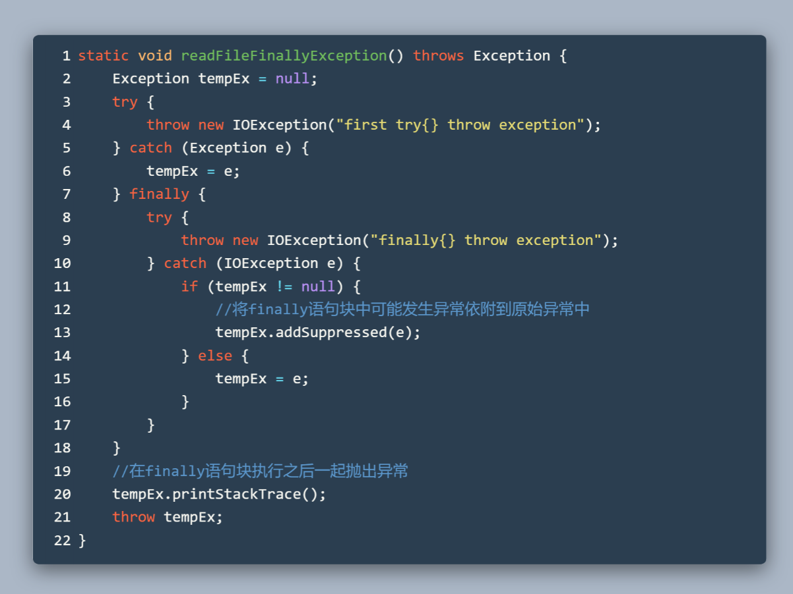
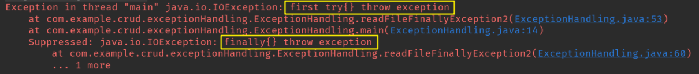

## Throwable、Error、Exception

Throwable 接口可以理解成是 Java 异常世界中的 Object。因为 Java 中的所有异常一定都是 Throwable 的子类。

<!--more-->


Error 描述的是那些系统本身出现的错误，比如 Java 虚拟机内部问题等等。这些错误一般和 Java 应用程序没什么关系，Java 程序则不应该在任何 Java 方法中使用 throws 关键字说明可能抛出 Error 及其子类相关的异常。

Exception 描述的是那些 Java 应用应该合理进行捕获的的异常。所有 Exception 的子类但不是 RuntimeException 的子类都被定义为**受检异常**。

对于**运行时异常**，比如数组范围越界，访问空指针，类型转换异常，这些异常都是由于 Java 代码的问题导致，最好在程序编写的时候就避免。

>总之，一个方法必须声明所有可能抛出的受查异常， 而非受查异常要么不可控制（ Error),
>要么就应该避免发生（ RuntimeException)。如果方法没有声明所有可能发生的受查异常， 编译器就会发出一个错误消息。

## try/catch/finally

如果方法中发生了某些异常但是没有进行捕获，程序则会在异常发生的地方终止然后输出异常信息。异常信息一般包含调用栈等信息。

程序可以通过 try/catch 代码块捕获包含在 try{} 中**可能发生的异常**，并在 catch 到**对应的异常类型**时执行 catch 中的代码。

try 中发生异常**且** catch 声明的异常类型**可以匹配**，try 中剩余的语句不执行，转而执行 catch 中的语句。没异常或不匹配就忽略 catch 中的内容。注意和 switch 语句不同，switch 需要在每个 case 后跟一个 break 避免执行后续的 case。

catch 块中可以继续抛出异常交给上层来处理。如果直接抛出其他类型的异常，这样会丢失原始的异常信息。

```java
catch (IOException e) {
  // 刚捕获到的异常对象 e 被丢弃
  throw new RuntimeException("待会再试");
}
```

更推荐的方法是**在抛出其他异常前保存原始异常或者将原始异常作为新异常的 cause(内因)**。且在抛出异常时，要提供合适的消息（对应下面代码的 "待会再试"）。


如果在 catch 块中**直接重新抛出刚捕获的异常**，那么 printStackTrace() 方法显示的是原本的调用栈信息，而不是新的抛出点信息。想更新抛出点信息的话，可以调用 fillInStackTrace() 方法。

```java
catch (Exception e) {
  throw e.fillInStackTrace();
}
```

有时候我们需要 **finally 子句**来回收特定的资源，不管异常有没有发生，finally 子句的内容在最终都会执行。

## try-with-resource

但是要小心 finally 中的语句也可能发生异常，**且在 finally 中抛出的异常会覆盖原始可能抛出的异常。**这样就丢失了原始的异常。

我们可以在 finally 中添加 try/catch 来捕获并处理异常。或者将 try 中发生的异常贴附给 finally 中的异常。




结果：



其实对于在 finally 语句块中发生异常情况的上述处理（通过 addSuppressed() 依附异常），正是 try-with-resource 语法做的事情。对于实现了 AutoCloseable 接口的**资源，**可以使用 try-with-resource 语法来自动回收资源。


输出结果和上面的代码类似，说明 try-with-resource 内部的实现方式也是类似的：对 close() 方法可能抛出的异常，将其 Suppressed 到原始异常中抛出。


## 总结

最后，结合《Effective Java》等相关资料，总结处理 Java 异常时的一些要点。

* 异常只用在异常发生的情况，不该用来进行程序流程控制。
* 注意区分 RuntimeException 和 受检异常，以及使用条件。
* 抛出异常时结合带 String 参数的构造方法提供更多信息。
* 捕获异常后并重新抛出异常时，注意保留原始的异常对象。
* 优先用 try-with-resource，而不是 try / finally。