# Lambda 表达式

**Java 8 开始，可以用 Lambda 表示只有一个抽象方法的接口**（**函数式接口，该类型的接口一般标有 @FuntionalInterface 注解**）。此前我们只能通过繁琐的匿名实现类表示。

比如，Runnable 接口就是一个**函数式接口**。<!--more-->

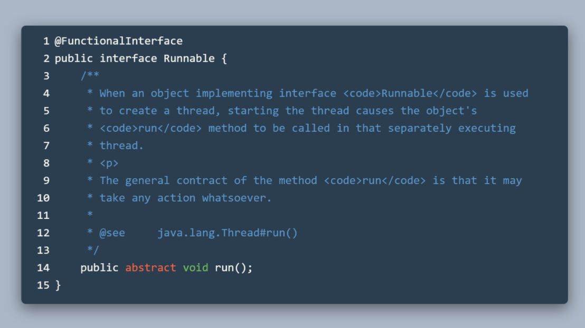


所以我们可以用 Lambda 表达式创建一个该接口的匿名实现。

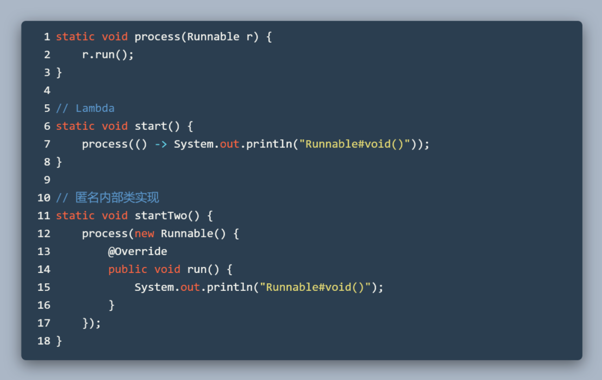


**() 表示**函数式**接口中定义的抽象方法的参数**，因为 Runnable 接口中的 run() 方法没有参数，所以用空的 () 表示。

**箭头后的内容表示**该方法的实现，这里就是指 void run() 的具体实现，且因为其返回类型是 void，所以无需返回特定类型，这里只进行了一个输出语句。

再比如下图的这个函数式接口 Predicate<T>，抽象方法的返回类型是 boolean，方法参数为泛型 T。

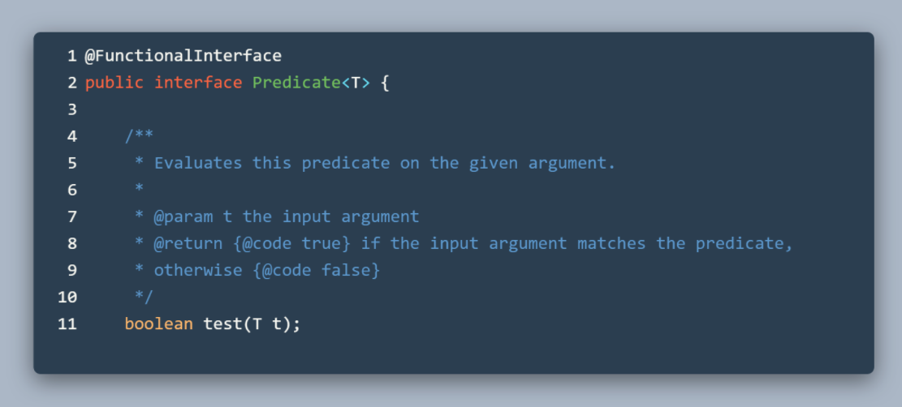


使用 Lambda 表示式实现的几种方式：

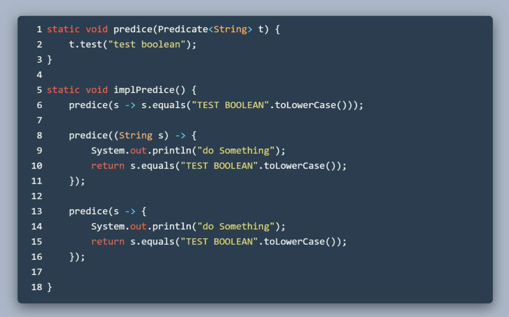


第 6 行中，第一个 s 表示入参，其中 s 为 String 类型。

箭头后的代码调用了 String 的 equals 方法，该方法返回 boolean，要和**函数接口中定义的方法一致。**

第 8 行到 第 16 行，说明 Lambda 的方法实现可以像普通方法的方法那样**有方法体和显式的 return 语句（需要用 { } 包括**）。

还有一个点就是 Lambda 很多参数类型都不需要声明，编译器会为我们自动进行类型推导。如果 Lambda 表达式的类型有歧义，编译器会告诉你需要指定对应的类型。


以下部分的代码几乎都由 List<Dish> 类型的 menu 变量作为构建流的基本元素。代码大致如下：

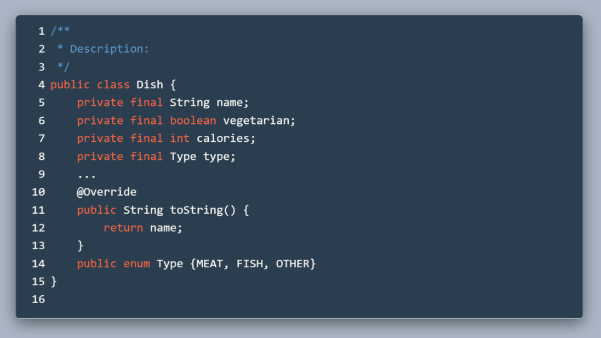


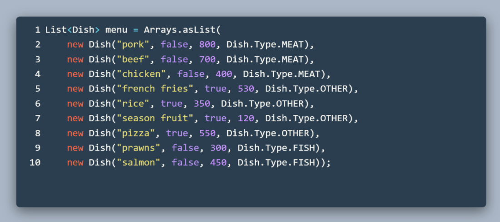


# Stream

了解 Lambda 表示式之后，来看看新的 Stream API。

## 什么是流

Stream<T> 接口的注释是这样的:

*"A sequence of elements supporting sequential and parallel aggregate operations."*

支持有顺序，可以并行地聚合操作的一串**元素序列**。


流的数据源头可以从集合，数组获得。有了基础流之后，可以对流进行数据处理，Stream API 定义了一系列简易的方法供我们使用。

虽然流和集合都是包含特定的元素序列，但是他们之间是有一些明显区别的。这两者可以类比成我们生活中的 DVD 和在线看电影。DVD 相当于集合，已经有了电影所有的帧。流则需要我们从网络中进行数据加载再处理。


## 操作流


图中是两种筛选 Dish 的实现。

第一种（第 16 行开始）使用常规的集合进行筛选。第二种（第 30 行开始）使用流进行筛选。

明显第二种方式简洁且可读性也好。

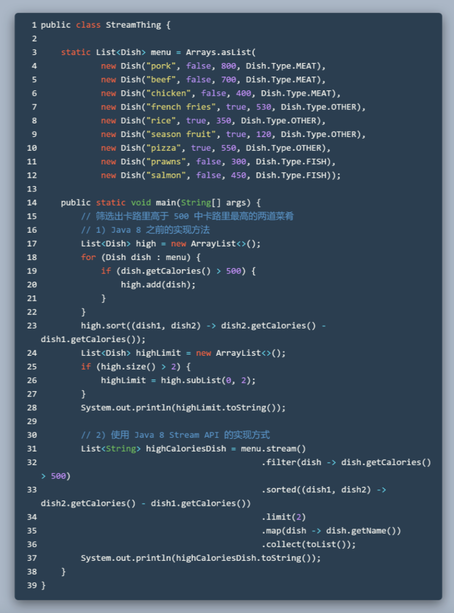


来看看使用流操作（第二种方式，第 30 行开始）中每个操作的含义：

第 31 行，**stream()** 方法从 menu 这一集合中（源头）产生流（Stream<Dish> 类型）供接下来操作。

第 32 行，**filter()** 方法筛选出卡路里高于 500 的菜肴，将筛选后的元素变成一个新的流（Stream<Dish> 类型）供接下来操作。

第 33 行，**sorted()** 方法按照卡路里高低排序，继续返回一个 Stream<Dish> 类型的流。

第 34 行，**limit()** 方法只从流中截断出只包含 2 个元素的流。

第 35 行，**map()** 方法将 Stream<**Dish**> 映射成 Stream<**String**>，返回一个菜肴名称的流。

第 36 行，**collect()** 方法将 Stream<String> 中的元素保存到 List 中。到此结束，所以 highCaloriesDish 变量的类型是 List<String> 类型的。

## Stream API

### 筛选

```
Stream<T> filter(Predicate<? super T> predicate);
Stream<T> distinct();
Stream<T> skip(long n);
Stream<T> limit(long maxSize);
```

### 映射

```
<R> Stream<R> map(Function<? super T, ? extends R> mapper);
<R> Stream<R> flatMap(Function<? super T, ? extends Stream<? extends R>> mapper);
```

map() 方法的功能是根据传入的实现将类型映射为其他类型。

map() 方法的参数 Function<...> 的定义是这样的：

```
@FunctionalInterface
public interface Function<T, R> {
    R apply(T t);
    ...
}
```

apply() 方法传入一个类型 T，然后根据方法实现返回类型 R。拿下图中的 map() 方法举例，传入参数类型为 Integer 的 i（对应 T），返回 i * i（也是 Integer 类型，对应 R）。

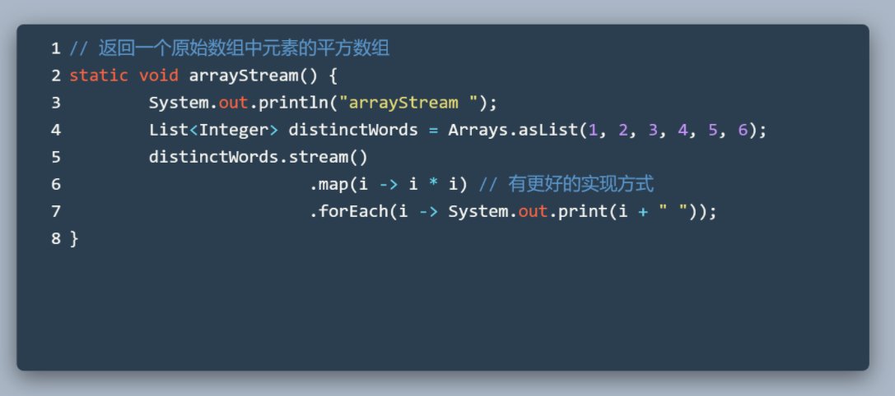


**扁平流 flatmap** 看下图的箭头部分，String 的 split() 方法返回的是 String[]，经过 map 映射后流中包含了这两个元素  {[H，e，l，l，o]，[W，o，r，l，d]｝。之后如果我们直接调用 distinct()，意味着作用的对象是 [H，e，l，l，o] 和 [W，o，r，l，d] 这两个流中的 String[] 数组，它们肯定是不一样的，故达不到目的。


Arrays.stream() 方法可以将传入的数组元素产生一个流。其方法签名是这样的：

```
public static <T> Stream<T> stream(T[] array) {
        return stream(array, 0, array.length);
}
```

Arrays::stream 返回 Stream<String> 列表后，map() 方法又将整个内容分别映射到不同的流中。故还是有问题。

再看 flatMap ，flatMap() 方法将流中的每个值都映射到同一个流中。

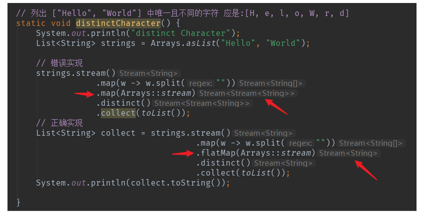

### 查找和匹配

```
boolean anyMatch(Predicate<? super T> predicate);
boolean allMatch(Predicate<? super T> predicate);
boolean noneMatch(Predicate<? super T> predicate);
Optional<T> findFirst();
Optional<T> findAny();
```

### 归约

```
T reduce(T identity, BinaryOperator<T> accumulator);
Optional<T> reduce(BinaryOperator<T> accumulator);
```

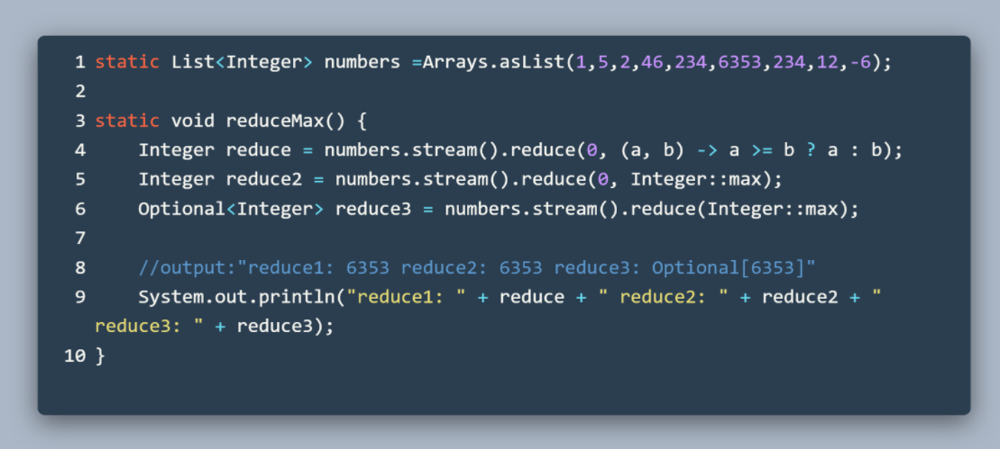


第 4 行：reduce 接受一个初始值 0，然后逐个比较选择大的那个数。

第 5 行：一样的功能使用方法引用表示。

第 6 行：reduce() 方法只接受一个参数，不接受初始值。为了应对 stream() 调用后**流中没有任何元素的可能性，**所以这个方法的返回值是 Optional 类型。

## 数值流

前面我们使用到的流都是针对**对象类型**的，在进行计算的时候其实包括了**隐含的拆装箱**操作。为此 Java 8 引入了三个针对特定**原始类型**的流来进一步简化操作，分别是 IntStream，LongStream 和 DoubleStream。可以通过 Stream<T> 中的 mapToInt/Long/Dubbo 方法将流转换为特性的数值流。

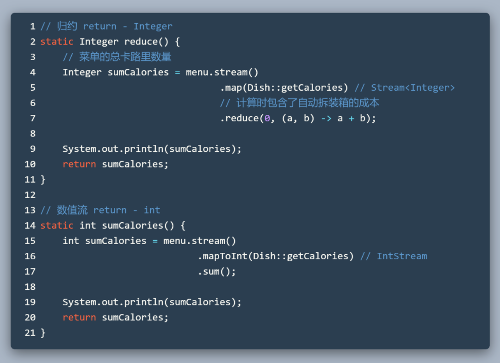


```
将特化流装箱为对应的对象类型流  
Stream<Integer//Long//.> boxed(); 
// 生成范围数值流
public static IntStream range(int startInclusive, int endExclusive);
// 包含起始值的范围数值流
public static IntStream rangeClosed(int startInclusive, int endInclusive);
```

## 如何构建一个流


此前我们获得流的方式都是通过集合调用 stream() 方法生成流，或者使用数值流的 range/rangeClosed 生成特定范围的数值流。这部分就来介绍生成流的其他方式。

- 由显式值构建流：**Stream.of()**

```
public static<T> Stream<T> of(T... values) { ... }
Stream<String> hello = Stream.of("hello", "test", "hi");
```

- 由数组构建流，接收各种参数并由之生成对应的流：**Arrays.stream()**

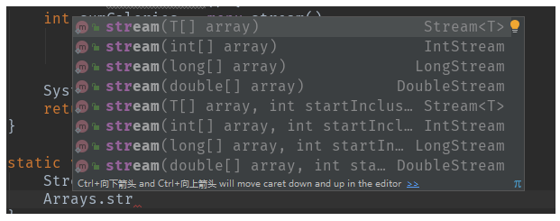

- 由文件获得流。Java 中用来处理文件的 API 更新后可以用来支持 Stream API。

借此顺便再看一下 flatMap ，Array.stream 的用法。注意看返回不同类型的 Stream。

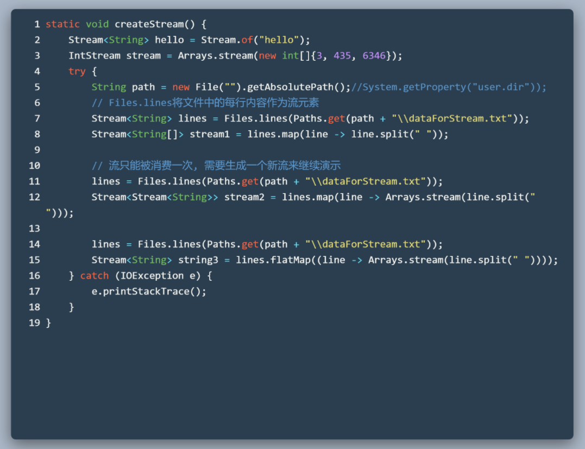

注意到第 11 行，我们使用流之前需要重新从文件中生成新的流。因为流只能被消费一次，你会发现如果重复消费会发生类似的异常。

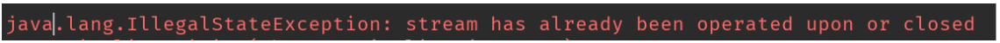

- 由函数生成流：**iterate()，generate()**

```
public static<T> Stream<T> iterate(final T seed, final UnaryOperator<T> f) {}
public static<T> Stream<T> generate(Supplier<T> s) {}
```

iterate 接受一个 T 类型的初始值，以及一个**每次都会作用在新值上的函数**（合时宜的话可以说是 Lambda）。有点像 reduce 那样。不同的是**iterate 会不断产生产生新元素**到流中。


generate 接受**一个不断产生新的值的 Lambda**。看一下其参数 Supplier<T> 接口中定义的方法就知道 generate 做的事情是什么了。

```
@FunctionalInterface
public interface Supplier<T> {
    T get(); // 唯一要做的就是提供一个生成新元素的实现
}
```

需要注意的是对那些可以生成无限流一般需要通过 limit() 方法来截断。


## 从流中收集数据

前面的代码中我们经常使用**Stream**的 **collect()** 方法配合入参 toList(）将流中的数据放到一个 List 中。其实这个 toList() 方法是定义在 Collectors 工厂类里面，其中还预定义了很多可以直接使用的方法。


当我们对流使用 collect() 方法的时候，就是为了使用传入该方法的**"参数"**进行对应的收集操作。

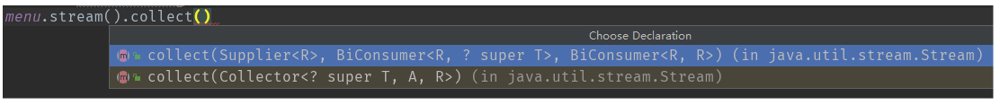


我们先来看看 API 为我们预先提供了哪些可以直接用的 "参数"（Collectors 类中提供的现有实现）

- groupingBy
- maxBy
- summarizingInt
- joining 等等。。。

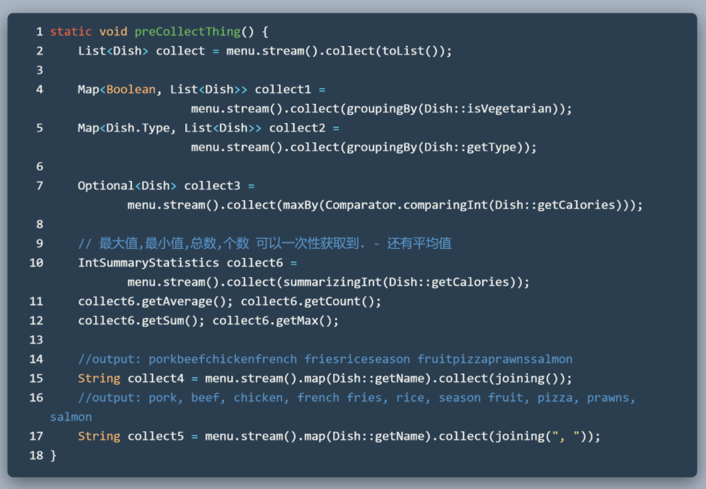


### 归约

**reducing**

前面提到的都是特定的收集方法，我们也可以通过 reducing() 方法来自己适应更广泛的收集情况。

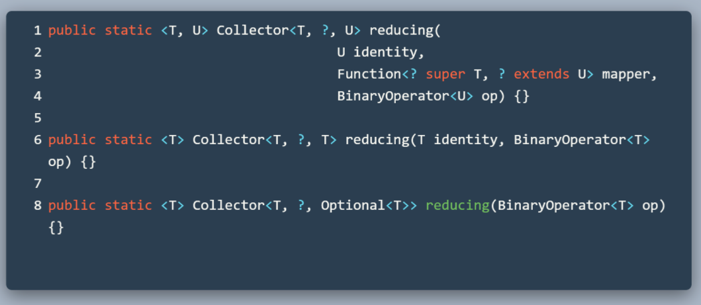


先来看有三个入参的版本，

- 第一个参数相当于给一个初始值。应对流中没有元素的情况。
- 第二个参数有点像 map() 方法，提供一个映射操作。
- 第三个参数就是针对映射后的参数类型进行操作。


或者也可以直接只提供一个针对流元素进行操作的 Lambda 操作（只有一个参数的版本），这样的话如果流中没有元素应该返回什么呢？所以可以看到返回类型出现了 Optional 类型来应对这种情况。

### 分组

#### Collectors.groupingBy()

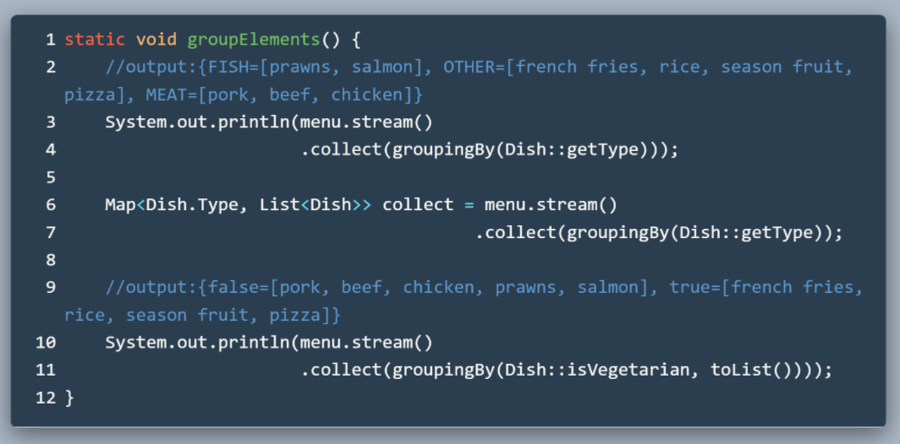


groupingBy() 先根据传入的 Function 类型参数，将流中的元素映射为特定的类型作为分类的依据（Map 中的 key 类型）。

groupingBy() 方法也提供了两个参数的版本。

Map 的 value 类型是 List 则是因为单个参数的 groupingBy() 方法默认传入的第二个参数是 toList() 方法。

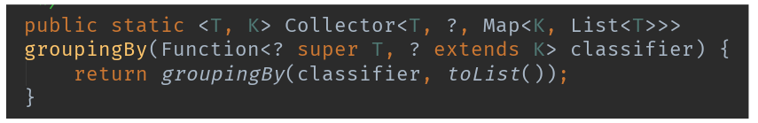

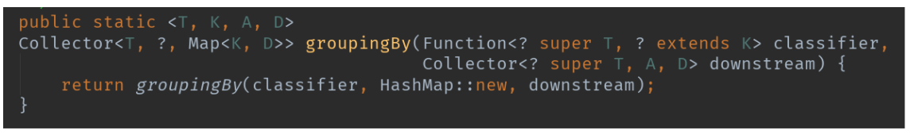

可以看到第二个参数的类型是 Collector 接口，说明还可以在第一层分组的基础上进行其他的操作。


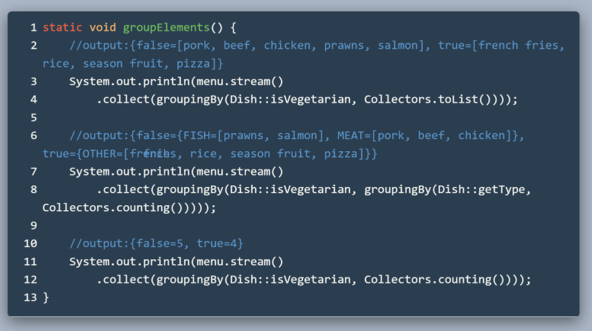


主要看第 1 行和 第 5 行的输出结果，可以说明第二个参数作用在了第一个分组的 value 中，因为传入了 Dish::getType ,所有又在第一次分组中根据类型进行了分组。

第 10 行的方法的 counting() 方法，计算了每个类别中包含的元素个数。

#### 分区：Collectors.partitioningBy()

分区是分组的一种特殊情况。只是分区返回的分类都是通过 true 和 false 来区分。true 和 false 的定义就取决于你传入的那段 Predicate<> 实现。

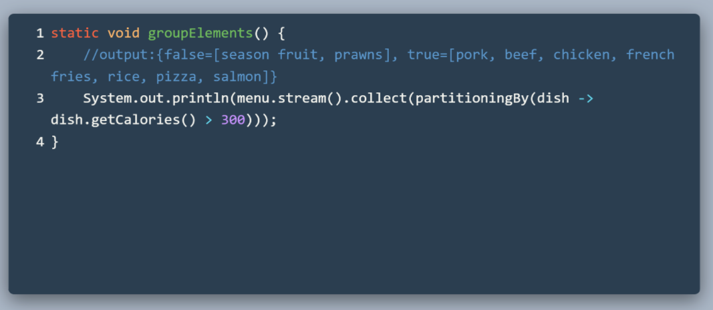

partitioningBy() 和 groupingBy() 一样也有重载包含两个参数的版本，用法也差不多。

