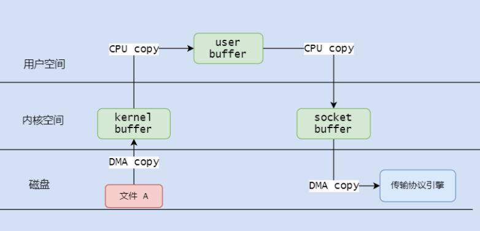
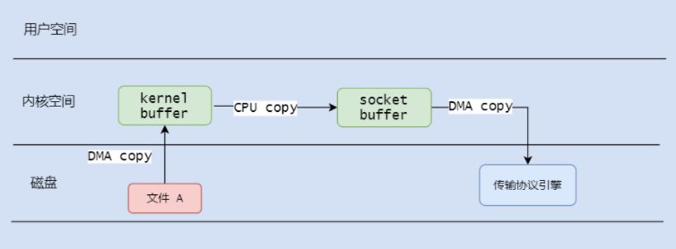
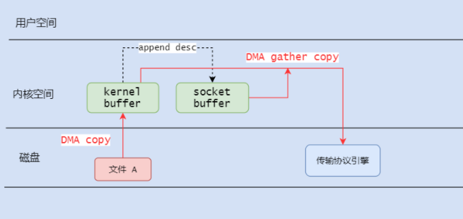

> **原文地址**：https://www.linuxjournal.com/article/6345?page=0,0
>
> wiki词条：https://en.wikipedia.org/wiki/Zero-copy

<!--more-->

## 零拷贝

**前置知识**

- **系统调用：操作系统为了统一接口提供的函数以供操作资源，比如 read，write方法**
- **用户态：用户程序运行的用户空间，无法直接访问底层硬件资源**
- **内核态：用户程序进行系统调用，委托内核态间接操作硬件资源**
- **DMA：直接存储技术，不通过 CPU 进行**

 

假设你打算使用某软件将本机磁盘上的文件传输给某个客户端。

因为计算机系统的保护机制，用户应用程序是在用户空间上运行，在涉及到硬件资源操作时，通过系统调用（比如调用 read() 方法读取文件内容），借助内核间接访问资源。

可以看到，整个过程有四次文件复制操作。过程中，因为涉及到内核态与用户态之间的上下文转换和频繁且缓慢的 I/O 操作，其读写性能是比较糟糕的。

 

零拷贝技术可以简单的理解成将参与到整个过程中的 **用户空间态** 省去，省去上下文切换的开销，减少 I/O 操作，很好的提高了效率。

图片中，从内核缓存到 socket buffer 的 copy 操作被优化了。这需要硬件技术的帮忙。

 通过支持聚集操作的网络接口，待传输的数据不必占用主存的连续空间，网卡的 DMA 引擎也可以将分布在不同位置的数据集中到一个数据传输中。

> 有疑惑的话可以戳[这里](https://stackoverflow.com/questions/9770125/zero-copy-with-and-without-scatter-gather-operations)
>
> 大概的解释就是，如果网卡不支持聚集操作，那么就需要将内核缓冲区中物理分布分散的数据通过 CPU 拷贝，连续的存放在 socket buffer 中以供 DMA 引擎拷贝。

 

在 Linux 的 2.4 内核版本，socket buffer 的描述符就被修改升级以支持适应刚才说的特性 - 这也是 Linux 零拷贝的基础。

 

不同之前的整个复制操作，内核将待传输数据的分布位置，待传输数据的长度等通过描述符复制给 socket buffer。 DMA 引擎（支持聚集操作）直接将数据从 kernel buffer 复制到协议引擎。

 

## 总结

实际上整个复制过程仍然包括了使用 DMA 引擎进行数据拷贝，所有不能说这是真正意义上的零拷贝。

 

但我们站在 CPU 角度，在没有引入零拷贝技术前，都会涉及到 CPU 拷贝的步骤。引入之后，CPU 参与的步骤变少，且没有了用户态和内核态的上下文切换，节省了 CPU 开销。

 

所以，可以在 CPU 角度看这个 "零"，而不是零次拷贝操作。