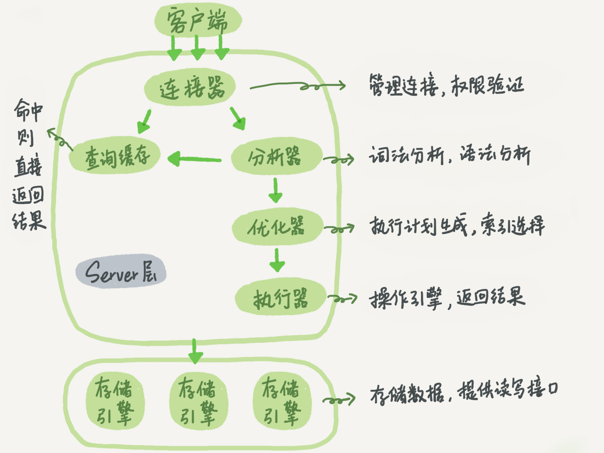
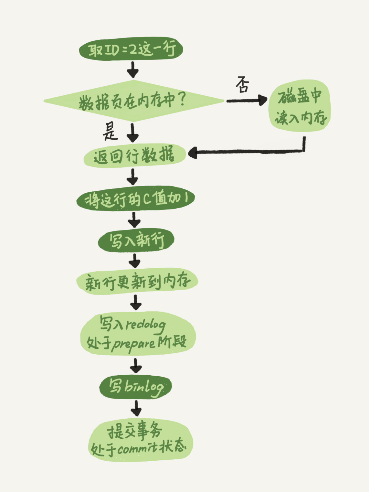
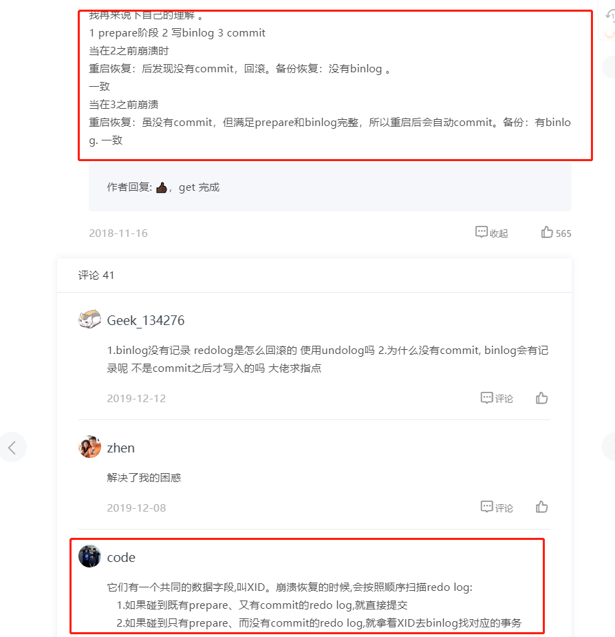
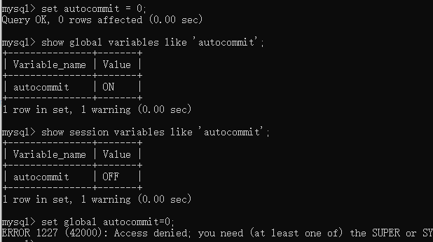
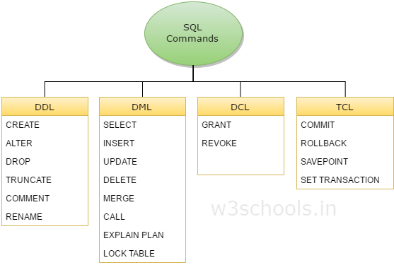
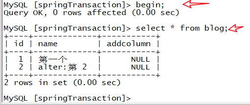
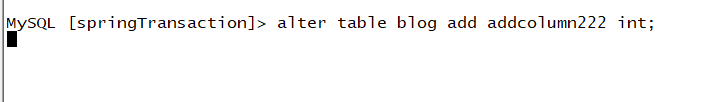

# 基础架构

<!--more-->



* show processlist;
* 一个连接长时间没有动静，会自动断开。由参数 wait_timeout 控制，defaule 8 hours
* MySQL 在一个连接中，执行命令 **使用到的临时内存**会被一直保留，直到这个连接断开才会释放

每课一问：

如果表 T 中没有字段 k，而你执行了这个语句 select * from T where k=1, 那肯定是会报“不存在这个列”的错误： “Unknown column ‘k’ in ‘where clause’”。你觉得这个错误是在我们上面提到的哪个阶段报出来的呢?

答：执行器。

正确答案：分析器。在分析词法和语法的时候，会判断表字段。

# 日志系统

## redo log

WAL，Write-Ahead-Logging，先写日志后写磁盘。redo log 是 InnoDB 特有的日志模块。

 

当有一条记录要更新的时候，执行器找 InnoDB 要这一行的记录，如果不在内存中的话，InnoDB 引擎从磁盘读取数据页到内存，返回给执行器。执行器把记录更新后，调用引擎提供的接口，InnoDB 会把数据更新到内存中，然后记录到 redo log 里。

InnoDB 会在系统比较空闲的时候把 redo log 里的内容更新到磁盘中。

redo log 是有大小限制的，当 redo log 满的时候，就需要把数据记录到磁盘，redo log 文件腾出空间后，再进行更新操作。

redo log 记录这个数据 “做了什么改动”，redo log 有 crash-safe 能力，即使数据库异常重启了，之前的提交记录都在，可以恢复。binlog 只能用来归档，从备库一个个重放。

## binlog

* binlog 是属于 Server 层面的，任何引擎都能用。
* binlog 记录的内容是请求的原始语句逻辑，类似 Redis 的 AOF 记录的是执行的命令。
* binlog 没有大小限制，理论上可以一直追加。binlog 文件写满后切换到下一个文件，不会覆盖以前的记录。

## 两阶段提交



redolog prepare 和 commit 状态。



## 最佳实践

```sql
# redolog 和 binlog，每次事务完成持久化到磁盘
# 在配置文件中设置，记得重启服务
innodb_flush_log_at_trx_commit=1;
sync_binlog=1;

show variables like 'log_%';
```

# 索引

索引是在引擎层面实现的，意味着不同的存储引擎采用的索引实现可能是不一样的。

从底层的数据结构来分析索引的各项特性

* 哈希表
* 有序数组
* 搜索树

## InnoDB 的索引模型

B+ 树，在 InnoDB 中，采用的是索引组织表，也就是说，每张表是通过 B+树来存储的。

每个索引对应着一棵 B+ 树。

因为 B+ 树需要维护索引的有序性，在数据改变的时候，就要进行调整。

这就需要先知道数据页的概念，InnoDB 操作数据时，需要将磁盘中的数据读取到内存中进行操作，读取和刷入磁盘都是以数据页为单位的。

当插入的新数据所在的位置的数据页刚好满了，就需要进行调整。-页分裂等等。

## 最佳实践

定义一个业务无关的自增 id，也就意味着：

* 每次新增数据，在主键索引树上，总是在最后的位置添加数据，很有效的减少了可能的 IO 成本。叶子节点分裂的可能性降低。
* 如果用整型做自增主键，这样**对普通索引**来说，叶子节点存储占用的空间也小很多。
* 还是要看具体的业务情况

# 事务的隔离性

## 事务隔离性和隔离级别

说到事务，就会提到事务的 ACID 特性，这一部分主要分析事务的 I（Isolaction），隔离性。

而隔离级别就是数据库对于事务隔离性的设计，事务源源不断的被开启，提交。不同事务之间可能操作同一部分的数据，就可能出现脏读（读未提交，可能读到脏数据）、幻读（读到的行数不一样）、不可重复读（同一个事务内前后读到的数据不一样）。


数据库为此，定义了四个隔离级别，隔离级别越高，隔离性就越好，但是性能可能就比较差。

* 读未提交。在事务期间内修改了数据且未 commit，修改后的数据就能被其他事务读取。
* 读提交。一个事务做的修改，只有提交后才能被其他事务读取到。
* 可重复读。一个事务期间读到的数据和事务启动时看到的数据一致。
* 串行化。读加读锁，写加写锁。直接阻塞。

## 事务隔离的实现方式是什么 - MVCC、数据的视图。

在 MySQL 中，每一次更新记录的时候都会同时记录一条回滚操作。也就是说，可以通过最新的记录的值，一次次的回滚取到之前不同状态的值。(以下针对“可重复读”这一隔离级别来分析。)

那总不能所以的回滚记录统统记录下来吧，一些版本的数据可能已经没有用了，因为在“可重复读”的隔离级别下，系统中可能没有事务要用到这个版本的数据了，就会被删除。

不同时刻启动的事务都有自己对于数据的视图。在这个事务内，采用这个一致性视图来读取值。（所以，事务内看到的数据和事务启动时的一致。）

MVCC，多版本并发控制。在 MySQL 中，同一条记录可以有多个不同的版本。

## 最佳实践

* 避免长事务
* set autocommit=0，自动提交事务功能关闭。要注意这个语句只对当前 session 有效。当你 begin 或者 start transaction 后，如果不在命令行显示使用 commit 或者 rollback，事务会一直持续到你显示结束。
* set autocommit=1，并记得及时显示提交。



## 相关命令和语句

```sql
#查看数据库隔离级别
show variables like 'transaction_isolation';

#查询超过 60s 的长事务
select * from information_schema.innodb_trx where TIME_TO_SEC(timediff(now(),trx_started))>60;

show session variables like 'autocommit';
show global variables like 'autocommit';
```

# 索引

* 底层数据结构：B+ 树。叶子节点存的是 页。
* 回表
* 索引维护。页分裂
* 索引下推
* 索引覆盖
* 最左前缀
* 联合索引

# 锁

## 全局锁

对整个数据库加锁。

典型的使用场景是对整库进行备份。

* Flush tables with read lock，让库处于只可读状态，其他任何写操作都被拒绝。
* 还有一种方式是用 set global readonly=true 的方式，不建议使用，原因在于
  * readonly 的值可能用在其他逻辑
  * 客户端设置库为 readonly 后，如果客户端端发生异常断开，数据库会一直保持 readonly 状态。Flush tables with read lock 的话，MySQL 会自动释放这个全局锁。

官方自带的逻辑备份工具是 mysqldump。使用 mysqldump 带 -single-transaction 参数时，备份是会启动一个**事务**，保证备份过程中数据的一致性。因为有 MVCC 的支持，期间数据库可以正常响应写请求。

**使用该种方式需要引擎支持数据库，MyISAM 就不支持，所以需要设置全局读锁。**

## 表级锁




* 一般意义的锁，DML（Data Manipulation Language）操作。（DDL Data Definition Language）
* MDL。在 MySQL 5.5 引入，系统会自动默认添加。主要目的是**针对改变表结构操作（DDL）**的锁。如果对表结构进行改变的话，**会加 MDL 写锁**。正常的 CRUD 的话，加 MDL 读锁。

**给一个表加字段、修改字段、加索引，需要扫描全表的数据。**

**Session A**：开启事务，查询数据，且未提交（默认添加 MDL 读锁）



**Session B**：对表进行 DML 操作，需要 MDL 写锁，但 A 中的 MDL 读锁没有释放，被阻塞。



**Session C**：对表进行查询，发现被阻塞

-2558947.png)

之后，在 **Session A**进行事务提交操作

.png)

**Session B**：

.png)

**Session C**：

.png)

事务中的 MDL 锁，在语句开始是申请，在事务结束时才释放。但是这也不太好解释为什么 C 中的查询语句会被阻塞，因为 B 申请 MDL 写锁失败了。（从设计初衷来说为了防止 C 被饿死，因为后续可能一直来 MDL 读锁，导致 C 一直不能被执行）。


## **行锁**

MySQL 的行锁是在引擎层实现的。但不是所有的引擎都支持行锁。

行锁的两阶段锁协议：在 InnboDB 的事务中，行锁在需要时才加上，等到事务结束时才释放。

## 死锁

# 事务到底是隔离的还是不隔离的？

事务的两种启动方式

* begin/start transaction，直到执行第一个操作表的语句才开启事务
* start transaction with consistent snapshot，语句一声明就开启事务

InnoDB 中每个事务都有一个唯一 ID，是在事务开始的时候，按照申请顺序严格递增的。

每次事务对数据的更新操作，随之会把事务 ID 和数据版本对应起来。

在可重复读的隔离级别下，事务启动的时候，在整个事务期间采用一个一致性视图。即这个事务是看得到在它启动前已经提交的事务的更新结果。

在实现上，InnoDB 为每个事务构造了一个数组，用来存储在该事务启动时，系统中还在“活跃”的事务 id。“活跃”指的是已经启动，但是没有提交的事务。

数组中存在着最小和最大的事务 ID 。

事务就会根据这个 “活跃”数组，来**找自己认可的数据版本（对应着 transaction id）**

 

事务判断要操作的这个数据的当前版本，**版本 ID 和最小最大 ID 的大小比较**（不是存不存在）：

* 小于数组中的最小 ID，说明这个版本是在其启动前已经提交的，认可它。
* 大于最大 ID，说明是未来已提交的，不认可。
* 在中间，那么存在两种情况
  * 在这个数组中有相同的 ID ，说明这个事务是“活跃”的，说明还没提交，不认可。
  * 没有相同的 ID，说明已经提交，要认可，即对于这个事务来说是可见的。

.png)

.png)

## 当前读

库中有数据（id，k）- (1，1)，事务 A get 到的 k 是 1，这个好理解。

但是事务 B get 到的 k 是 3，这就让人很疑惑了。

**当前读**说的是：在**更新**的时候，总是先读再写，读的值必须的**当前的值。**

事务 C 改成下面这样呢？

.png)

事务 C' 没有马上提交，而 B 要更新 k 值，需要进行当前读。因为 C' 没有提交，该行的写锁还没释放，B 就会被阻塞。

# 第二部分

# 普通索引和唯一索引应该怎么选择？

老样子，看业务场景。

唯一索引的缺点是 **在插入的时候**一定要在内存中进行唯一判断才能插入。

普通索引的缺点是 **在查询的时候**相比与唯一索引**可能需要**多一次判断。

但是，存储引擎一般都是按页从磁盘读取数据，所以普通索引在查询时候的多一次判断的数据大概率已经被读取到内存中，所以只要多一次指针寻找和计算。开销可以说是微乎其微的。

## change buffer

**对于更新操作**，普通索引和唯一索引就存在不同的开销了。这都要归因于 change buffer。

当需要更新一个数据时，如果数据页在内存中就直接更新。如果不在内存中，InnoDB 会先把更新操作记录到 change buffer，暂时不从磁盘读取数据以减少 IO 开销。

等到有查询该数据的请求的时候，才会进行磁盘 IO，并把 change buffer 中的操作合并，返回结果。这样就避免了数据不一致。

change buffer 中存的操作应用到实际的数据页上，有三种情况

* 后台线程定期 merge
* 访问到这个数据页的时候
* 数据库正常关闭的时候

change buffer 还是可以持久化的，这应该是避免数据库不正常关闭的情况。

对于普通索引和唯一索引，change buffer 对更新会有什么影响呢？

* 更新的唯一索引需要判断唯一性，总是要读入内存来判断，利用不了 change buffer 带来的优势。
* 对于更新已经在内存中的数据，二者没差。

## 最佳实践

都得看业务场景，对于读多的场景，更新请求记录在 change buffer，避免了磁盘 IO。但是马上对该数据的读请求来了，这是一定要读取的内存的请求，change buffer 就没啥用了，可能反而增加了记录和 merge 的开销。

**“尽量选择普通索引”**

```plain
show variables like '%innodb_change_buffer%';
```

# 

# MySQL 有时候为什么会选错索引？

选择索引是优化器的工作，其中的影响因素包括了

* 扫描行数
* 是否采用临时表
* 是否排序
* 等等。。

采样分析计算索引信息，所以可能不太准确。

通过 explain 来判断一个语句的执行情况

```plain
explain select * from t where (a between 1 and 1000)  and (b between 50000 and 100000) order by b limit 1;
```

-2559058.png)

* rows 代表可能扫描的行数
* Extra 中说明使用了索引
* key 代码会选择索引 b 进行查询

```plain
explain select * from t where (a between 1 and 1000)  and (b between 50000 and 100000) order by b,a limit 1;
```

.png)

## 直接最佳实践

* 人为强制选择索引，使用 force index()

```sql
select * from t force index(a) where a between 1 and 10000 ...;
```

* analyze table <table name>，矫正一下，重新计算索引信息

## 怎么给字符串字段加索引？

```plain
alter table SUser add index index1(email);
或
alter table SUser add index index2(email(6));
```

使用前缀索引，定义合适的长度，既可以节省索引的空间，又能减少查询的开销。

# 为什么表数据删掉一半，表文件大小不变？

* innodb_file_per_table，5.6.6 后，默认是 ON。这个参数 ON 的时候代表每个表都用单独的文件存储。OFF 代表表数据存储在共享空间中。

MySQL 中记录数据的删除实际上不是我们理解的真正的删除，而是标记删除，表示该位置可复用。

当整个数据页没有数据的时候，MySQL 通过把它标记为可复用（即空间没有变小），但是该数据页可以复用到任何位置。（也就是说不受）

更新索引上的值也和删除一样，会造成数据页中的空洞。因为索引需要保证有序性。

## 重建表

重建表的大概步骤是重新读取表 A 中的值，依次放到临时表中，紧凑的排列，然后交换表名，删除旧表，启用新表。

```plain
alter table <table name> engine=InnoDB;
```

# "order by" 到底是怎么工作的？


