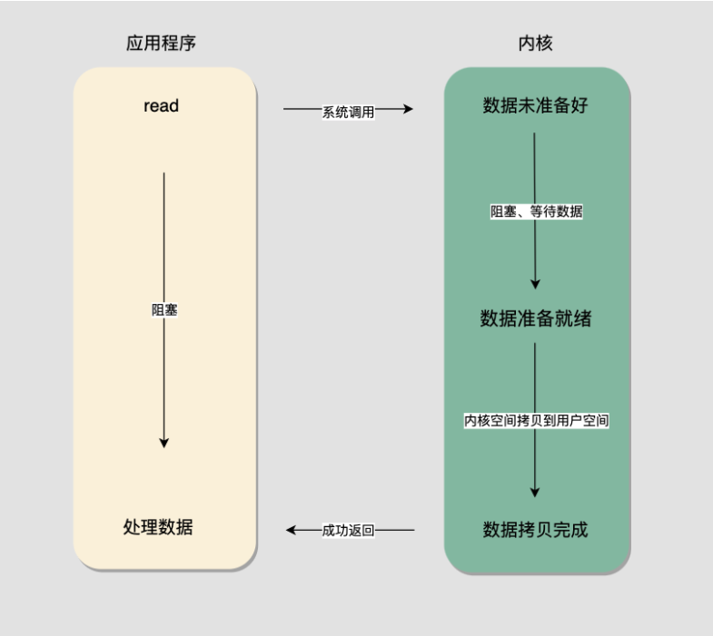
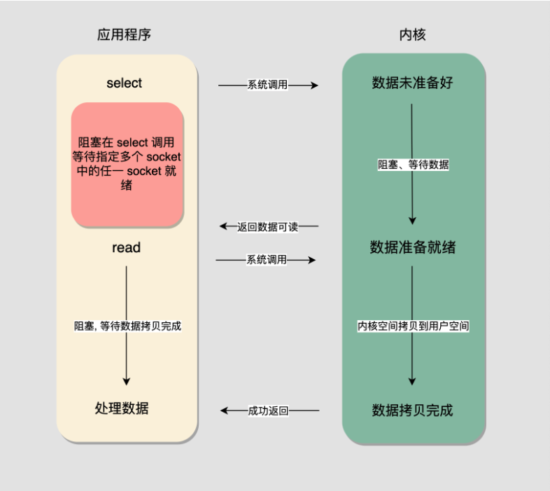
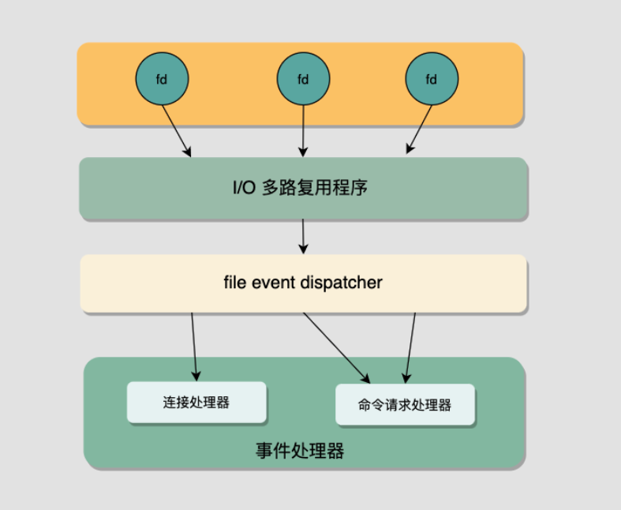

常说 Redis 利用 I/O 多路复用，单线程处理来自许多客户端的网络请求。本文简单的从网络通信、I/O 模型、Redis 大致如何利用 I/O 多路复用模型了解下相关知识。

<!--more-->

## 什么是 socket ？

* [https://en.wikipedia.org/wiki/Network_socket](https://en.wikipedia.org/wiki/Network_socket)
* [https://docs.oracle.com/javase/tutorial/networking/sockets/definition.html](https://docs.oracle.com/javase/tutorial/networking/sockets/definition.html)
* [https://man7.org/linux/man-pages/man2/socket.2.html](https://man7.org/linux/man-pages/man2/socket.2.html)
* [https://www.geeksforgeeks.org/socket-programming-cc/#:~:text=Socket%20programming%20is%20a%20way,other%20to%20form%20a%20connection.](https://www.geeksforgeeks.org/socket-programming-cc/#:~:text=Socket%20programming%20is%20a%20way,other%20to%20form%20a%20connection.)

## socket 网络模型的基本函数

* [socket()](https://man7.org/linux/man-pages/man2/socket.2.html)，为了进行网络 I/O 通信，**进程必须做的第一件事情就是调用 socket() 函数**，指定期望的通信协议类型等。socket() 调用成功会返回一个非负整数值，称为 sockfd，一般称作特指 socket 的[文件描述符](https://en.wikipedia.org/wiki/File_descriptor)。
* [connect()](https://man7.org/linux/man-pages/man2/connect.2.html)，客户端通过调用 connect() 函数来请求连接。
* bind()，绑定 socket 和给定的地址和端口。如果服务端或者客户端没有调用 bind() 进行绑定，当调用 connect() 或 listen() 时，内核会为相应的 socket 选择一个临时端口。对于服务端来说，**因为需要对外提供服务，所以服务端一般会主动调用 bind() 指定特定的端口和 socket 绑定来对外提供服务。**
* [listen()](https://stackoverflow.com/questions/4696812/passive-and-active-sockets)，当通过 socket() 创建一个新的 socket 时，一般这个 socket 被称为**主动套接字，也就是说该套接字被看作可能调用 connect() 函数发起连接请求的。**在向一个未连接的套接字调用 listen() 函数后，**套接字转换为被动套接字，**内核就知道应该接受指向该套接字的连接请求。

```plain
int listen(int sockfd, int backlog);
```

其中的第二个参数 backlog 定义了可以为当前套接字进行连接的最大队列数。也就是说，如果客户端连接请求到达时，该套接字的处理队列长度达到 backlog 时，返回 error。

* [accept()](https://man7.org/linux/man-pages/man2/accept.2.html)，accept() 会从待处理连接队列头中取出连接请求，并在传入的第一个参数 sockfd 指向的监听套接字（或者说被动套接字）上创建一个**新的已连接套接字，返回的 int 就是指向生成新套接字的 sockfd。**原本的监听套接字不受影响。

```plain
int accept(int sockfd, struct sockaddr *addr, socklen_t *addrlen);
```

**内核会为服务器对每个客户端的连接创建一个已连接套接字，**且当服务结束后，相应的已连接套接字会被关闭（服务端的监听套接字一般持续存在）。

## 5 种 I/O 模型

>[https://notes.shichao.io/unp/ch6/#io-models](https://notes.shichao.io/unp/ch6/#io-models)

* 阻塞 I/O
* 非阻塞 I/O
* I/O 复用
* 信号驱动 I/O
* 异步 I/O

### 阻塞 I/O 模型



### I/O 多路复用模型



在这个模型里，程序会阻塞在 select 调用上。select 函数允许程序**同时监听多个 fd**的就绪状态。

## select/poll/epoll, kqueue 等调用

* [https://man7.org/linux/man-pages/man2/select.2.html](https://man7.org/linux/man-pages/man2/select.2.html)
* [https://en.wikipedia.org/wiki/Select_(Unix)](https://en.wikipedia.org/wiki/Select_(Unix))
* ......

## Redis 与 I/O 多路复用模型

通常我们说 Redis 采用单线程架构且提供高并发访问。**这里说的单线程其实是指 Redis 对于命令执行和网络 I/O 处理采用单个主线程**。但是像 bgsave 等功能其实会使用到其他进程。

（*在 Redis 6.0 中，Redis 对****网络请求****模块采用了多线程处理*）

Redis 采用 Client/Server 访问架构，需要同时处理许多来自外部客户端的请求，也就意味着 Redis Server 会为每个客户端在本地维护一个对应的 socket。Redis 通过统一封装不同支持 I/O 多路复用的系统函数供上层使用，比如 select/epoll，kqueue 等系统调用，在不同平台上提供服务。即 Redis 不阻塞在单一的 sockfd 读写等待上，而是同时监听多个 sockfd 的就绪状态，不断处理就绪可处理的 sockfd。

具体来说，Redis 通过提供自己的文件事件处理器来实现相关的功能。

* I/O 多路复用程序同时监听多个 sockfd，当其中有 sockfd 准备就绪(产生对应的事件)，I/O 多路复用程序将就绪的 sockfd 放入准备好的队列，同步有序地一个一个将套接字给 file event dispatcher。
* file event dispatcher 根据传来的对应事件分配给对应的事件处理器进行处理。



## 总结

Redis 通过利用 I/O 多路复用模型，结合简洁的模块设置，让 Redis 在单线程架构的基础上同时为多个客户端提供服务。

## 参考链接

- [Redis 和 I/O 多路复用 - 面向信仰编程](https://draveness.me/redis-io-multiplexing/)
- [https://notes.shichao.io/unp/ch6/#io-models](https://notes.shichao.io/unp/ch6/#io-models)
- [epoll的本质 知乎](https://zhuanlan.zhihu.com/p/63179839)

