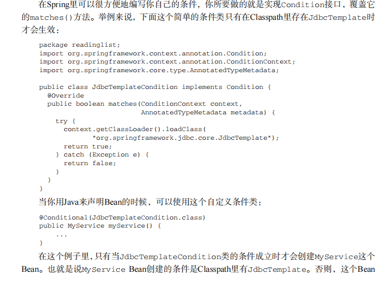
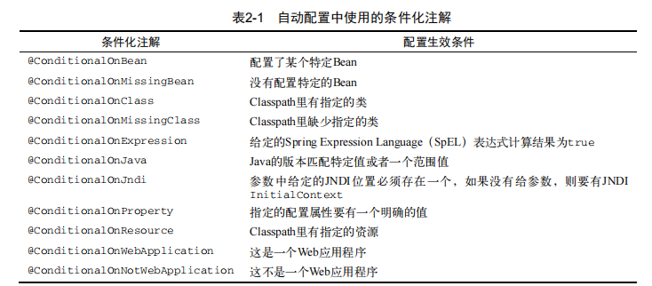
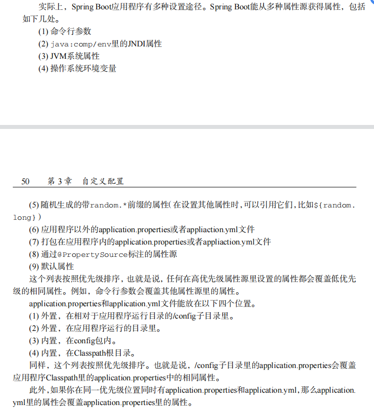

# 起步依赖

不用定义版本，起步依赖中包含的依赖版本都交由 SpringBoot 的版本进行管理。<!--more-->

如果你想要排除某个起步依赖中包含的不需要的依赖，在起步依赖中加 <exclusions/><exclusion/><groupId/>即可

如果需要制定某个依赖的版本，额外正常定义指定即可，Maven 会使用最近定义的依赖，覆盖传递依赖引入的另一个依赖。如果用 Gradle，**因为 Gradle 倾向于引入较新版本****的****依赖**，如果你需要**指定较低****版本****的依赖**，需要先排除起步依赖中的相关依赖，再引入特需版本依赖。

# 自动配置

每当程序启动的时候，SpringBoot 的自动配置都需要根据 ClassPath 里是否有某个类来做合适的 Bean 配置。根据各种内置的自动配置类的条件是否匹配进行一些配置方便用户直接使用。

## 条件化配置

自动配置的类都在 spring-boot-autoconfigure 这个jar 包中。里面的自动配置类使用到了 Spring 提供的**条件化配置**（Spring 4.0开始引入）。Condition 类与 @Conditional 注解。

SpringBoot 提供的丰富的条件化注解

## 覆盖自动配置

自动配置的 @ConditionalOnMissingBean 注解，是覆盖自动配置的关键。

## 自动配置的各种属性配置微调

# 相关书籍

《SpringBoot 实战》

