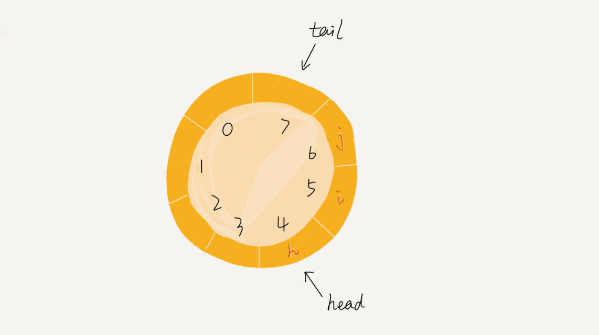

# 复杂度

**时间复杂度：**代码执行时间随着数据规模变化的趋势

**空间复杂度：**代码消耗空间随着数据规模变化的趋势
<!--more-->

# 数组

一组连续的，存储相同数据类型的内存空间。

## 特点

提供 根据下标 的 时间复杂度为 O(1) 的元素访问

插入，删除操作。**交换，标记**

# **链表**

**通过 指针(引用) 将零散的内存块连接起来**

```
public class ListNode {
    int value;
    ListNode next;
    public ListNode (int value) {
        this.value = value;
    }
}
```

## **单链表**

## 循环链表

## **双向链表，双向循环链表**

## 特性

理论上，删除，插入操作只需要修改指针的指向，为 O(1) 的操作。但是，在实际生产环境中，删除，插入操作有两种情况（双向链表的好处）

1. 操作**给定值**条件的结点。这种情况需要遍历链表，找到目标
2. 操作**给定指针**指向的结点。这时已经可以访问到目标结点，但是要对它进行操作，需要知道它的前驱结点。这时双向链表就可以提供 O(1) 的操作，单链表则需进行遍历。

## 链表代码

**务必理解 指针 或者 引用的概念**

### 链表的边界条件处理

    1. 空链表
    2. 链表只剩一个结点
    3. 链表剩两个结点
    4. 对于代码处理到 **头结点，尾结点**的情况

例如删除操作，正常情况下

```
p.next = p.next.next;
```

如果链表只剩一个结点，则会出现错误，改进方法

```
if (p.next == null) p = null;
```

对于插入操作

```
newNode.next = p.next;
p.next = newNode;
```

如果是空链表，p.next 会出问题（null.next），改进方法

```
if (p == null) p = newNode;
```

### 哨兵结点

对 **插入第一个结点** 和 **删除最后一个结点** 需要进行特殊处理

在任何时候，不管链表是否为空，head 指针始终指向该虚拟结点。

对于插入操作的空链表情况，删除操作的只剩一个结点情况

```
// 插入操作，head 始终指向 dummy
Node dummy = new Node(..);
newNode.next = p.next; //此时 p 指向 dummy
p.next = newNode

// 删除操作
p.next = p.next.next; // 此时 p 指向 dummy 结点
```

# 堆栈

栈，操作受限的线性表。只允许在其一端进行操作(pop,push)

## 简单栈的实现

顺序栈，链式栈 (一个 top 指针)

## 应用

### 函数调用栈

操作系统给每个线程分配了一块独立的内存空间，这块内存被组织成“栈”这种结构, 用来存储函数调用时的临时变量。**每**进入一个函数，就会将临时变量作为**一个栈帧**入栈，当被调用函数执行完成，返回之后，将这个**函数对应的栈帧**出栈。

### 表达式计算

编译器通过两个栈，操作数栈，运算符栈。从左向右扫描表达式，遇到数字压入操作数栈，遇到运算符，和运算符栈的栈顶元素比较运算符优先级，如果较高，压入栈顶。如果优先级相同或者比较低，取出栈顶运算符，从操作数栈取两个数运算。把结果压入操作数栈顶，运算符继续和运算符栈顶元素比较。

### 括号匹配

# 队列

先进先出，后进后出。

enqueue，dequeue

## 队列实现

顺序队列，链式队列

循环队列



## 应用

# 排序算法

## 分析排序算法的一些指标

* **稳定的排序算法。对于相等的元素，他们的前后顺序会不会改变。**
* **是否是原地排序。没有使用额外空间，空间复杂度为 O(1) 的排序算法**
* **最好，最坏，平均时间复杂度**
* **比较，交换次数**

## **冒泡排序**

在比较相邻元素时，相等时不交换彼此之间的位置。**稳定。**

最好情况下，发现没有交换元素操作，提前退出。O(n)

最坏，O(n^2)

## 插入排序

把第一个元素先作为**已处理区间**，之后每次在**未处理区间**中选择元素插入到已处理区间的合适位置。

## 选择排序

一开始全视为未处理区间，在未处理区间中选择最小（最大）的元素，依次放到已处理区间中。（交换思想）

## 归并排序

## 快速排序

分区函数。

## 线性排序

时间复杂度为 O(n) 的排序算法。对待排序数据的要求苛刻，即比较小众。

### 桶排序

### 计数排序

### 基数排序

# 二分查找

```
// 无重复的已排序区间
public int binarySearch(int[] nums, int value) {
    int low = 0;
    int high = nums.length - 1;
    while(low <= high) {
        int mid = (low + high) >> 2; // 傻逼了
        int mid = (low + high) >> 1;
        int mid = （low >> 1）+ （high >> 1）; // 位运算符的优先级和 int 溢出问题。 
        if (nums[mid] == value) {
            return mid;
        } else if (value < nums[mid]) {
            high = mid - 1;
        } else low = mid + 1;
    }
    return -1;
}
```

二分虽然效率高，但是要求苛刻。

1. 底层需要是数组，可以提供 O(1) 的随机访问

2. 数据严格有序，且不重复（看情况）。

3. # 跳表

# 散列表

## 散列函数

## 散列冲突

### 解决散列冲突

    1. 开放寻址
        1. 线性探测。散列表中的 **空闲位置 ，**往下探测。
        2. 2 次探测
        3. 双重散列
    2. 链表法。后面不一定

.png)

# 哈希算法

将任意长度的二进制串映射成 **固定长度** 的二进制串。

# 树，二叉树

* 叶子节点
* 根节点，在第一层，深度为 零
* 层
* 深度
* 高度

## 二叉树

## 满二叉树

## 完全二叉树

## 二叉树的存储方式

链式存储

顺序存储。基于数组的顺序存储方式，**完全二叉树** 的组织结构，数组空间连续被填满，中间不会浪费过多数组空间。

## 遍历二叉树

**前中后序遍历的代码实现**

```
public void preorderTraversal(ListNode p) {
    if (p == null) return;
    sys(p.getVal());
    preorderTraversal(p.left);
    preorderTraversal(p.right);
}
public void midorderTraversal(ListNode p) {
    if (p == null) return;
    midorderTraversal(p.left);
    sys(p.getVal());
    midorderTraversal(p.right);
}
```

# 二叉查找树

**二叉查找树 中的****每个节点****，其左子树中的****每个节点都小于这个节点****，右子树中的都大于这个节点。（相对于 散列表，二叉查找树数据的组织方式相对有序，且中序遍历出的数据有序）也称为 二叉排序树。**

# **红黑树**

# **堆排序**

**堆，是一颗完全二叉树，且树中的每个节点都必须大于等于（或小等于）其所有子树中的每个节点的值。**

## 操作堆

## 堆排序

## 堆应用

# Trie 字典树


# 图的表示

## 邻接矩阵

-2562505.png)

好处是 计算简单，获取顶点之间的关系快速。

比较费空间。对于无向图来说，A[i][j] 和 A[j][i] 的值相同，矩阵一半的空间都被浪费掉了。

## 邻接表、逆邻接表

.png)

好处是，比较节省空间，拉出的结构可以是链表，也可以是其他更高效的结构，比如红黑树，跳表等。

链表的存储方式对缓存不友好。

