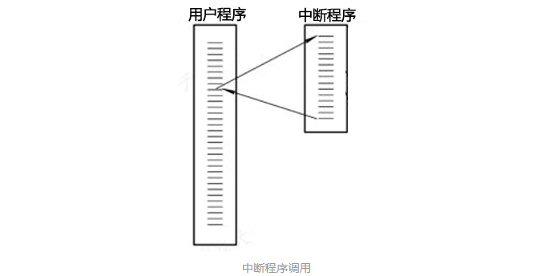
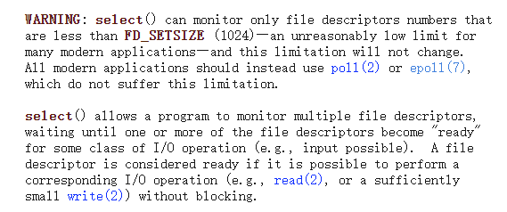
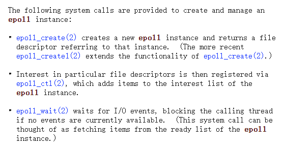
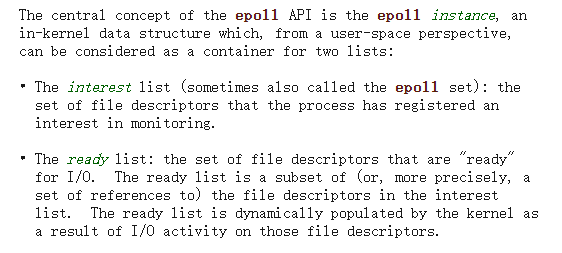
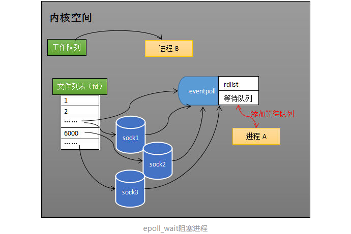

## 从网卡接收数据说起

1. 网卡收到传输的数据
2. 并将收到的数据写到内存<!--more-->
3. cpu 中断。网卡将数据写入内存后，向 cpu 发出中断信号，cpu 执行网卡中断程序。（硬件的信号优先级高）

4. 中断程序主要有两个功能。
   1. 将数据写到对应的 socket （与端口对应）接收缓冲区中。执行过程中对应的进程进入**对应的 socket 等待队列**（阻塞状态）。
   2. socket 接收到数据后，操作系统唤醒该进程，进入工作队列（运行状态）。

## 服务端如何同时监视多个 socket 的数据状态？

### select 

> https://man7.org/linux/man-pages/man2/select.2.html

假如进程 A 需要同时监控 socket1，socket2，socket3。调用 select 后，操作系统把进程 A 分别加入到**这 3 个** socket 的等待队列中。

进程A 阻塞在 select 调用上。

当任何一个 socket 有数据后，中断程序唤醒进程，将进程 A 从**所有等待队列**中移除，加入到工作队列中。进程 A 被唤醒后，说明至少有一个 socket 收到了数据，**遍历 socket_sets** 就可知道哪个有数据。

我们知道，如今的服务端需要同时管理的客户端连接数比较大。select 调用中需要多次遍历，需要同时监听的 socket 越多，select 调用的效率越低。也是因此，select 最多支持同时监听 1024 个 socket。

### epoll

> https://man7.org/linux/man-pages/man7/epoll.7.html

#### 流程

假如进程 A 需要同时监控 socket1，socket2，socket3。先调用 [epoll_create](https://man7.org/linux/man-pages/man2/epoll_create.2.html) 方法创建一个 eventpoll 对象（返回一个 fd 指向该对象），和 socket 类似，eventpoll 也有自己对应的等待队列。

调用 [epoll_ctl](https://man7.org/linux/man-pages/man2/epoll_ctl.2.html) 添加/删除 监听的 socket（interest list（rbr））。操作系统将 eventpoll 对象添加到 socket1/2/3 的等待队列中。

当任何一个 socket 有数据后，中断程序为 eventpoll 的 **ready list（双向链表）** 添加对应的 socket 引用。**唤醒等待队列中的进程。**

进程 A 执行到 [epoll_wait](https://man7.org/linux/man-pages/man2/epoll_wait.2.html) ，等待数据，如果 **ready list** 不为空，epoll_wait 返回，**唤醒 eventpoll 等待队列中的进程**。如果为空，进程 A 阻塞在 epoll_wait 调用上等待数据，操作系统会把进程 A 加入到 **eventpoll 的等待队列**中。

#### 优势

epoll 通过一个中间层 **eventpoll 对象及其对应的等待队列**，进程被阻塞时只需要一次添加到等待队列中。

通过 **ready list** 引用有数据的 socket 。进程被唤醒后，可以直接知道哪些 socket 有数据。

#### 相关链接

- https://zhuanlan.zhihu.com/p/63179839
- https://man7.org/linux/man-pages/man7/epoll.7.html
- https://man7.org/linux/man-pages/man2/select.2.html
- 上面提到的直接引用 socket，操作系统中间都有一些间接结构，并非直接引用。

