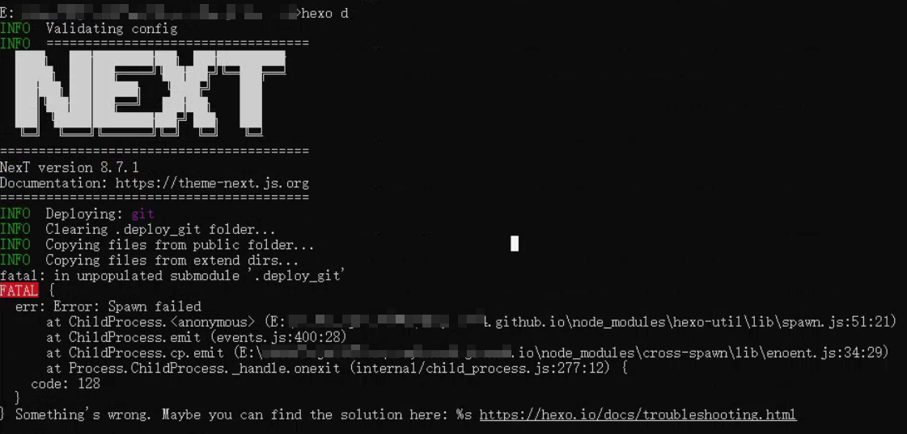

## 本地初始化一个Hexo项目

**注意：本地的目录不要动**，**可以重命名**。

重新新建一个空目录，作为你的博客目录。进入该目录，初始化一个Hexo项目：<!--more-->

```
hexo init
npm install
npm install hexo-deployer-git *--save
```

然后用自己原来博客里的文件替换掉这里的`source\`, `scaffolds\`, `themes\`,`_config.yml`替换成自己原来博客里的。**注意，一定要把themes/next中的.git/目录删除**


然后上传到代码仓库，同时初始化了 main 分支。

最后切换 git checkout -b hexo, 之后基于这个分支做修改，hexo d 部署在配置的分支上，这边就是设置的 main 分支（和 github page 里设置的分支一致可直接在 page 中访问到）。

## 注意事项

使用到的插件列表：


`.gitignore`文件中过滤了`node_modules\`，所以 clone 来的目录里没有`node_modules\`，这是hexo所需要的组件，所以要在该目录中重新安装hexo，**但不需要hexo init**。

```
npm install hexo
npm install
npm install hexo-deployer-git --save
```

### 不过滤 .gitignore 的内容协作尝试

hexo clean，hexo generate 正常，hexo d 部署的时候报错



.deploy_git 文件夹冲突，猜想应该是 hexo d 的时候操作 .deploy_git 的时候文件无法覆盖类似的冲突。

解决方法：删除 .deploy_git，重新 hexo d 生成即可。（我们可以在 .gitignore 里过滤这个文件夹）


## 常见语法

- tag: 
  - -&nbsp;tag1
  - -&nbsp;tag2
- 空格：'&nbsp + ;'
- 文章缩略显示：<!--more-- >


## 样式设置

[关于footer修改问题 · Issue #928 · iissnan/hexo-theme-next (github.com)](https://github.com/iissnan/hexo-theme-next/issues/928)

[Hexo 显示分类、标签问题](https://blog.csdn.net/Wonz5130/article/details/84666519)

[Hexo-Next 主题博客个性化配置](https://blog.csdn.net/as480133937/article/details/100138838)

- 目录自动展开和换行：主题配置文件搜索 toc。

## 参考链接

[mac和windows协同写hexo博客](https://wandouduoduo.github.io/articles/902dbefe.html)

[hexo 图片显示+typora](https://www.caoayu.xyz/post/hexo/)

