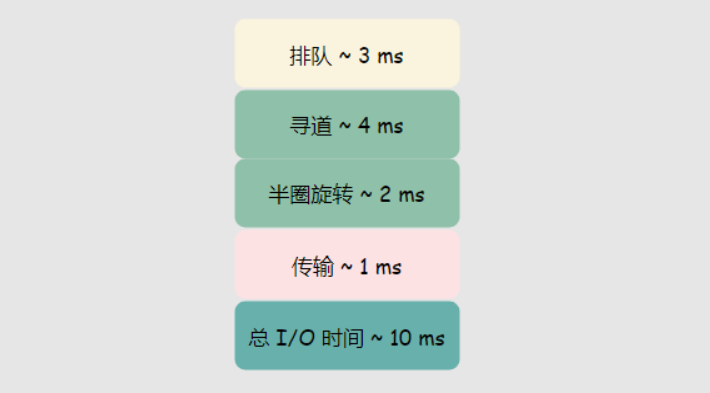

# 磁盘 I/O

>《数据库索引设计与优化》第二章

## 随机 I/O

每次数据库从磁盘随机读取一个页大约会花费**10 ms**左右，10 ms 是根据磁盘活动等情况大致估算出来的。我们只要意识到每次随机 I/O 的成本是很高的即可。

<!--more-->

## 

## 顺序 I/O

顺序读取的速度大约在**40 MB/s**，对于一个 4 KB 大小的页来说，平均的页读取时间为 0.1 ms，相比随机 I/O 的 10 ms提升了两个数量级。

顺序读取的优势在于，DBMS 意识到将要读取多个页，将发出多页 I/O 请求。且由于 DBMS 事先知道哪些页需要被读取，可能预先将其读取。

# 索引模型

实现索引的方式有很多种，采用不同方式设计的索引在不同的场景的效率也不同。对应的效率可以类比到数据结构的特性。例如依赖哈希表设计的索引天然不适合范围查询。

* B-Tree
* 哈希索引
* 空间数据索引
* 全文索引

# InnoDB 采用的索引模型

不同的存储引擎的索引的工作方式不尽相同。本文主要分析 MySQL 中最常用的存储引擎 InnoDB 的索引。

InnoDB 采用 B+Tree 实现索引，每张表通过主键以索引的形式存放（建表时没有指定主键，MySQL 会自动给一个 ROW_ID 作为主键），这种存储方式一般也称为索引组织表（index organized table，iot）。

InnoDB 实现的 B+Tree 只在叶子节点存储数据，非叶子节点只用作索引定位使用。

B+Tree 的特点

[https://www.javatpoint.com/b-plus-tree](https://www.javatpoint.com/b-plus-tree?fileGuid=PD9KHHH3T6GPvkdY)

B+Tree 的树高低，在索引定位的过程中，访问不同数据快的次数和树高相当，可以很好的减少磁盘随机 I/O 的次数。而且一般根节点，一级索引很可能已经在内存中，磁盘随机 I/O 的次数更低了。

# 主键索引与普通索引

主键索引叶子节点需要存储整行的数据。主键索引一般也成为聚簇索引（clustered index）。

普通索引的叶子节点存储的是主键的数据。普通索引一般称为二级索引。

一个查询使用到普通索引时，有可能需要回到主键索引获取对应的数据，一般称作**回表**。

# 使用 MySQL 索引

[https://www.mysqltutorial.org/mysql-index/](https://www.mysqltutorial.org/mysql-index/?fileGuid=PD9KHHH3T6GPvkdY)

# 索引设计、优化

在具体索引设计前，先了解下使用到索引的查询语句的一些特性。

* 索引覆盖，查询的列如果在索引中存在直接通过索引中的值返回。
* 索引下推，判断谓词如若在索引内部存在，优先通过索引内部字段进行谓词判断，减少回表的过程。
* 索引最左前缀原则，比如一个索引（age，name，sex）,相当于覆盖了 （age），（age，name）这两种索引。
* 前缀索引。通过截断前缀作为索引字段。可以节省空间。但是可能会损失一些查询性能，因为数据库需要根据主键回表判断这个值。前缀索引还可以影响到索引覆盖，同理无法直接从索引树返回结果。

假设有表 user（id，age，name）,主键 id，表上有索引（age，name）。

对于查询语句 SELECT name FROM user WHERE age = 3;

**索引覆盖**：使用普通索引定位到 age = 3 的位置后，在索引中扫描返回对应的 name 字段。而**不需要根据对应的主键 id 回到主索引**获取 name 的值。

对于查询语句SELECT id FROM user WHERE age = 3 and name = "fang";

**索引下推**：使用普通索引定位到 age = 3 的位置后，在**索引内部**获取 name 继续判断是否符号谓词条件，最后直接访问 id。

但是在 MySQL 5.6 之前，只能**回到主索引**一个个判断 name 的值。

# 理想的索引

>《数据库索引设计与优化》第四章提出的三星索引的概念，即对于一个查询语句可能的最好索引。如果查询语句使用了三星索引，一次查询通常只需要一次磁盘随机读以及一次窄索引片的扫描。

对特定的查询语句，三颗星的定义如下：

* 第一颗：查询使用到的谓词的列作为索引的开头。（通过等值谓词最小化操作集）
* 第二颗：ORDER BY 使用到的列添加到索引中。（避免结果排序）
* 第三颗：查询语句需要返回的结果集的列全部被包含在索引中。（避免回表查询，对应多次的随机磁盘 I/O）

比如有表 user（id，name，age，city，gender）

查询语句 SELECT * FROM user WHERE age = 3 and name = "fang" order by city；

* 第一颗：索引设计为（age，name）
* 第二颗：在后面添加 city，（age，name，city）
* 第三颗：SELECT *，索引中未包含 gender，（age，name，city，gender）

书中提出说**第三颗星通常是最重要的**，原因是如果索引中未包含查询需要返回值时，需要回表进行多次速度较慢的**磁盘随机读**。

但是在实际场景中，想要同时满足三颗星咩有那么简单。虽然我们总是可以向索引添加所有查询需要的字段来满足第三颗星。但是这样第一颗星和第二颗星就可能会冲突。

比如查询语句 SELECT name, city FROM user WHERE age BETWEEN 4 AND 24 and city = "fujian" ORDER BY name;

首先，添加索引 （city）满足第一颗星，然后可以添加 age，（city，age）满足第三颗星，同时刚好为 between 语句避免了回表判断。现在如果为了满足第二颗星以避免排序，name 这个索引的位置应该在 age 的前面才是预期的行为。

联合索引会按照索引字段的顺序组织数据。对于 age BETWEEN 4 AND 24，ORDER BY name 来说，任一字段排在其他字段的前面就始终无法满足条件。（age，name) 先按照 age 的顺序排序后，name 的有序性只能在 age 相同的行之间保证。（name，age）同理。

# 索引维护

为了保证索引有序性，插入新数据时可能触发页分裂，影响到性能。

页分裂后会影响到页的利用率，影响到空间。

可以重建索引来重新组织索引。

alter table user drop index age; // 重建索引 age

alter table user drop primary key; // 重建主键索引

# 索引分析

通过 explain 分析语句的执行情况。

[https://dev.mysql.com/doc/refman/5.6/en/explain-output.html#explain_rows](https://dev.mysql.com/doc/refman/5.6/en/explain-output.html#explain_rows?fileGuid=PD9KHHH3T6GPvkdY)

使用索引的一些坑

1. **谓词条件字段**通过函数操作，可能导致优化器放弃选择索引。因为通过函数计算后的索引得到的值，无法通过原本有序的索引树定位数据。
2. 隐式类型转换。可能会触发对索引字段做函数操作进行转换。放弃走索引树定位的原因同上。
3. 隐式字符编码转换。

# 参考链接

- [MySQL 索引设计概要 - 面向信仰编程](https://draveness.me/sql-index-intro/)
- [https://www.javatpoint.com/b-plus-tree](https://www.javatpoint.com/b-plus-tree?fileGuid=PD9KHHH3T6GPvkdY)
- [https://www.mysqltutorial.org/mysql-index/](https://www.mysqltutorial.org/mysql-index/?fileGuid=PD9KHHH3T6GPvkdY)

