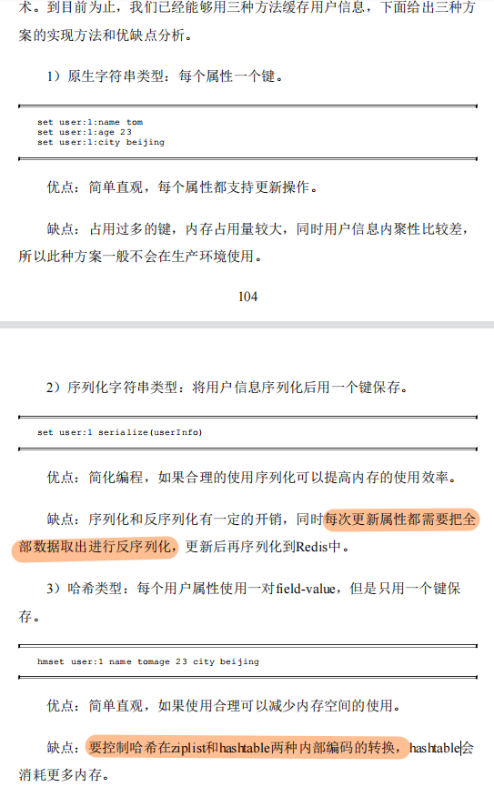

# 第一部分

## 基础数据类型的用法

在学习操作具体数据类型前，先来学习可以应用在所有 key 上的常用命令。多多利用 Tab 键补全可以使用的 Redis 命令。<!--more-->

>[https://redis.io/commands#generic](https://redis.io/commands#generic)

* help [command]。 对 [command] 的简单介绍
* TTL [key]。seconds - 过期时间，1 - key 存在且没有过期时间，2 - key 不存在
* expire [key] [seconds]，设置过期时间
* dbsize，key 的个数
* exists [key]，0 不存在，1 存在
* type [key]

### 字符串

#### 命令

>[https://redis.io/commands#string](https://redis.io/commands#string)

1. **新增、更新**

* set key value [expiration EX seconds|PX milliseconds] [NX|XX]
  * NX，不存在 key 才会执行 set - 可以避免覆盖，用于新增
  * XX，只存在 key 才会 set - 更新场景
* setex key seconds value，同时设置 expire time
* setnx key value，和 NX 选项一样的作用，用于新增
* mset key value [key value ...]，批量设置键值对

2. **获取**

* get key
* mget key [key ...]

3. **数字计算**

如果 key 的 value 是整数，则可以进行自增减操作。

* incr，decr [key]。如果 key 不存在，先设置 key 的值为 0，然后 +- 1
* incrby，decrby [key] [num]。自增减指定数字大小。

利用批量设置 mset，批量获取 mget 代替多次重复的 set 和 get 操作可以很好的节省 C/S 之间的多次网络 I/O 成本，和多次等待命令执行的时间，因为 Redis 采用单线程串行执行命令。

进行批量操作的时候要注意同时操作的个数，避免阻塞线程。

#### 使用场景

* 访问限制。在一定时间内限制频繁访问，配置 expire time 并通过 incr(key) 小于某个数值进行限制。比如发送验证码短信的 api，限制一分钟内获取多少次次，将 phoneNumber 作为 key set 进去，设置过期时间，incr 限制次数。
* 字符串有很多适用场景，结合提供的命令进行使用。比如 setnx ，incr。

### 哈希

第一部分讨论的数据类型指的是存储的 value 的数据类型。Redis 本身会维护一张全局哈希表，用来快速获取 key 对应的 value 。注意不要把这两个 hash 搞混了。

#### 命令

hash 类型的 value 存储多个**field-value** 映射。

1. **设置**

* hset key field value。设置新的 field-value
* hsetnx ....
* hmset key field value [field value ...]。批量设置 field 值

2. **获取**

* hkeys key，获取 key 的所有 field 
* hget key field，获取 key 的特定的 field 的 value
* hmget key field [field ...]，批量获取 field
* hgetall key，获取 key 的所有 field-value
* hlen key，获取 key 的 field 的个数
* hstrlen key field，获取 field 的 value 的长度

3. **删除 key 的 field**

* hdel key field [field ...]。针对 field 。想要删除整个 key-value 直接用 del [key] 即可
* hexists key field。判断 key 是否存在对应的 field 值

 

4. **数字计算**

* hincrby key field increment
* hincrbyfloat key field increment。hincrbyfloat 可以对 22 进行操作

对 hash 的**操作主要针对的类型是 hash 类型里的 field 域 ，**会帮助我们更好理解。

#### 使用场景

哈希类型用来存储类似关系表展示的信息看起来相比于 字符串 类型更加直观。




### list

list 类型可以存储多个有序的字符串。支持双端的 push 和 pop，且因为是有序存储，可以通过索引下标获取元素。

#### 命令

1. **插入，特定位置插入，修改特定位置的值**

* rpush/lpush key value [value ...]，从右往左/从左往右依次插入元素
* linsert key BEFORE|AFTER pivot value，在 list 中的 pivot 元素前/后插入 value
* lset key index value，修改 index 索引的值，变成 value

2. **获取：通过 index 获取特定元素、获取索引范围内的元素**

* lrange key start stop。获取的元素会包含 stop 索引在的元素（如果有的话）
  * lrange key 0 -1 ，获取从左到右所有元素
* lindex key index，获取指定 index 的元素
* llen key，获取 list 的长度
* list 的索引下标从左到右是 0 和 length -1。从右到左是 -1 到 -N？？？？？？？

3. **删除：头尾弹出单个元素、指定保留索引访问内的元素、删除指定的 value 元素**

* lpop/rpop key，从list 左/右弹出一个元素
* lrem key count value。从 list 中删除指定的 value 值，如果 count = 0，删除所有匹配的 value；如果count > 0，从左到右至多删除 count 个匹配的 value。如果 count < 0 ，从右到左至多删除 -count 个匹配的 value
* ltrim key start end，截取 list，保留范围内内的元素。同样的 end 索引值的位置会被包含（如果有的话）
* blpop/brpop key [key ...] timeout。**阻塞 timeout 秒，直到 pop 出数据**

#### 运用场景

.png)


### set

set 也用于保存多个字符串元素。set 和 list 不同之处在于 set 是存储的元素是**无序**的且**不允许有重复的元素。**

set 除了常规的 crud 外，还支持计算集合键的 交集，并集，差集等。利用这些计算可以很好的运用在实际问题中。

#### 命令

1. **操作集合内部元素的命令**

* sadd key member [member ...]，添加元素
* * spop key [count]，随机从 set 中**弹出**指定 count 个元素
* srem key member [member ...]，删除指定的元素
* * srandmember key [count]，无 count 则默认为 1。从 set 中**随机返回** count 个元素
* smembers key，返回 set 中的所有元素
* * scard key，计算 set 中的元素个数。O(1)
* sismember key element，判断元素是否存在

2. **集合之间的操作**

* sinter key [key ...]，多个集合之间的交集
* sunion key [key ...]，多个集合之间的并集
* sdiff key [key ...]，集合之间的差集
* * sinterstore destination key [key ...]，将求交集结果直接存储在 destination 中。destination 也是 set 类型。
* sunionstore，sdiffstore 也是一样的。

#### 应用场景

标签场景。

.png)


### sorted set

sorted set 保留了 set 不能存储重复元素的特点，新增了 score 属性，作为**排序**的依据。也就是说 sorted set 是有序的 set，但是内部存储元素的方式不同，sorted set 通过 score-member 存储。注意 sorted set 中不能重复的元素指的是 score-member 中的 **member**，score 可以一样。

#### 命令

1. **新增**

* zadd key [NX|XX] [CH] [INCR] score member [score member ...]
  * nx，xx 和之前提到的作用一样，nx 保证 member 不存在才能设置，用于新增。xx 保证 member 存在才能设置，用于更新
  * ch，返回操作后发生变化 score-member 的个数
  * incr [num]，将 member 对应的 score + num
* zcard key，计算 key 中 member 的个数
* zrem key member [member ...]，删除 key 中对应的 member
* zscore key member，获取 member 的 score
* 

2. **根据 score 操作**

* [zrangebyscore](https://redis.io/commands/zrangebyscore) key min max [WITHSCORES] [LIMIT offset count]，返回**指定 score**在 min-max 范围内（默认都包含）的 member。
  * LIMIT 的 offset 限制 rank 的起始位置（0 表示第 1 位），count 限制返回的个数。
  * zrangebyscore z:rank (10 +inf limit 2 5
    * (10 表示 > 10，如果不加 "(" 默认表示 >= 10，+inf 表示无穷大，-inf 表示无穷小。 
    * limit 2 5 表示返回从排名 第 2+1 位开始，往下 5 个输出结果。
* zcount key min max，返回指定 score 范围内的 **member 个数**
* **fd**
* zremrangebyscore key min max，删除指定 score 范围内的 member

3. **根据排名操作**

* zrank key member，**从低到高**计算**特定 member 的排名**
* zrevrank key member，**从高到低**计算**特定 member 的排名**
* zrange key start stop [WITHSCORES]，返回**指定排名访问内**的**member**
  * start 从 0 开始，同样的 stop 会被包含（如果有的话）
  * withscores 同时返回 member 对应的 score
* * zremrangebyrank key start stop，删除指定排名内的 member

4. **集合之间的操作**

* zinterstore destination numkeys key [key ...] [WEIGHTS weight] [AGGREGATE SUM|MIN|MAX]

#### 应用场景

排行榜系统

.png)

### Bitmap

二值状态统计，比如签到未签到，打卡未打卡，用 0和1就可以表示。

Bitmap 底层是使用 String 类型，String 本身会保存为二进制的字节数组，字节数组的每个 bit 位就可以用来表示一个元素的二值状态。

#### 命令

* SETBIT key offset 1/0，设置bit 数组偏移了 offset 位上的 bit 为 0/1。注意 offset 是从 0 开始的。
* GETGIT key offset
* BITCOUNT key
* BITOP，可以对多个 Bitmap 的每个 bit 位进行 『与』或者『异或』操作。

### HyperLogLog

HyperLogLog 是一种用于统计基数的数据集合类型，它的优势在于不管集合元素数量如何，**计算基数**所需的空间总是固定的。12KB 内存可以计算约 2^64 个元素的基数。

HyperLogLog 的统计规则是基于概率完成的，给出的统计结果有一定误差。

#### 命令

* PFADD page1:uv user1 user2 user3
* PFCOUNT page1:uv

[12 | 有一亿个keys要统计，应该用哪种集合？ (geekbang.org)](https://time.geekbang.org/column/article/280680)

# 第二部分

## 慢查询分析

>[redis.conf 中文翻译](https://github.com/funcrayon/redis.conf-zh_cn#slow-log%E6%85%A2%E6%97%A5%E5%BF%97)

慢查询分析只会统计命令真正执行时的时间，注意不包括命令的排队，传输时间等等。

*  slowlog subcommand [argument]
   * slowlog len，获取日志长度
   * slowlog get [n]，获取 n 条记录。没有 n 则是获取全部

慢日志输出结果字段分析：

1) 1) (integer) 2  // 唯一标识

    2) (integer) 1603002171 // 时间戳

    3) (integer) 22522 // 执行时间

    4) 1) "keys" // 执行命令

  2) "*" // 参数

    5) "127.0.0.1:33696"

    6) ""


## redis-benchmark

redis-benchmark 可以为 Redis 做简单的基准测试。

* redis-benchmark
  * -c [num] 客户端并发数量，默认 50
  * -n [num] 客户端请求总量，默认 100000
  * -q，加上该选项则仅输出 requests per second 信息
  * -r [keyspacelen]，插入随机键进行测试， keyspacelen 只用来定义
  * -P <numreq>，每个请求 pipeline 的数据量，默认 1
  * --csv，结果按照 csv 格式输出

## Lua 与事务

### 事务

Redis 可以通过 multi 命令开启事务，[exec ](https://redis.io/commands/exec)命令表示事务结束或者 discard 命令取消事务。在 multi 命令和 exec 命令之间的命令会**原子性并按照顺序执行**。

>[https://redis.io/topics/transactions](https://redis.io/topics/transactions)

想要执行一组包含在 multi 和 exec 之间的命令时

1. 对于语法正确的命令（语法正确，但不一点能正确执行，比如想要 get 一个不存在的 key），都只会返回 QUEUED 表示排队待执行。最后使用 exec 执行事务时，
2. 对于语法直接有错误的命令，直接会返回 error 相关的信息。最后使用 exec 执行事务时，会提示你 Transaction is discarded。说明整个事务内的命令都不会执行。

在最后执行 exec 执行事务时，第一种情况**最终会执行那些正确的命令**；第二种情况最终会出现类似 Transaction is discarded 的提示信息，表示整个事务回滚了；

Redis 还提供一个 WATCH key 命令用于在 multi 之前来确保事务中的命令操作的 key 没有被修改过，事务才正确执行。

### Lua

待定


# 第三部分

## 一，基本架构

索引模块 - 数据库根据 key 定位对应的 value 位置。Redis 和 Memcached 采用哈希表作为**索引的类型**。

通常基于内存的键值数据库都会采用哈希表（随机访问的时间复杂度O(1)），这也和内存的硬件特性有关 - 提供高性能的随机访问。

**内存分配器。**数据库中存储的键值对一般大小不一，不同的内存分配器面对这些情况有不同的效果。Redis 提供多种内存分配选项，之间的分配效率也不同。

.png)

## 二、数据结构

采用全局哈希表高效定位 key 对应的 value 的位置。哈希冲突影响性能后，采用渐进式 rehash 把数据拷贝，最后迁移至更大的哈希表中。

渐进式 rehash 过程中，服务器仍响应客户端请求，对于已拷贝的数据，如果被修改会如何处理？

比如索引 5 中的 entry （entry 中包含了 key，value 指针分别指向实际的键和值）链被拷贝到新的哈希表 2 中，后续的请求修改了索引 5 中的 value 值，需要重新去哈希表2中寻找并修改对应值吗？

答：《Redis 设计与实现》中具体说明了渐进式 rehash 的过程 - rehash 时，哈希表 1 某个索引中的数据“拷贝”至哈希表 2 后，哈希表 1 中对应的索引值会设置为 NULL。

**丰富的数据类型使用的底层数据结构种类。**

.png)

压缩列表类似数组，都是紧凑的数据结构，但压缩列表在表头固定有三个字段分别表示：列表长度，列表尾的偏移量和列表中的 entry 个数；表尾固定有一个 zlend 表示列表结束。（LPOP,RPUSH 等操作，只要 O(1) 的时间复杂度）

跳表就是添加多级索引的链表。O(logN)

## 三、Redis 中的单线程指的是什么？

我们常说的 Redis 单线程，**指的是 Redis 中的网络 IO 和键值对读写由单线程完成（对外提供的两个主要服务）**。其他的诸如持久化，数据同步等是由其他线程完成的。

.png)

Redis 6.0，把网络 IO 相关的事情利用多线程处理了 -> 客户端请求的读取和解析。

第 3 讲 和 第 39 讲

[https://redislabs.com/blog/diving-into-redis-6/](https://redislabs.com/blog/diving-into-redis-6/)

## 四、AOF

append only file

WAL - redo log，为什么传统数据库采用 wal 日志？

AOF **采用后写**，命令执行成功才写入日志，避免检查命令的开销，后写可以避免阻塞当前的命令，但是可能阻塞后续的命令，这个取决于将**AOF 缓冲区同步到****aof****文件**的三种策略（Always，Everysec，No）。注意 AOF 写入是在主线程进行的。

**AOF 重写**，创建**新的 AOF 文件**，读取数据库中的所有键值对并记录。AOF 重写是由子进程 bgwriteaof 完成，避免阻塞主线程。**子进程 Copy on Write**，共享主线程的内存数据。子进程 fork 时是一定会阻塞主线程的。

关于 Copy-On-Write。Redis 调用 fork() 创建子进程，子进程会复制和父进程一样的 page table，这个过程是会阻塞的。子进程和父进程共享同一份内存实例，当父进程需要修改内存中的数据时，父进程会把新的数据或者修改后的数据写到新的物理内存地址中，并更新自己的 page table 映射。

* [https://www.geeksforgeeks.org/copy-on-write/](https://www.geeksforgeeks.org/copy-on-write/)
* [https://en.wikipedia.org/wiki/Copy-on-write](https://en.wikipedia.org/wiki/Copy-on-write)
* [https://en.wikipedia.org/wiki/Virtual_memory](https://en.wikipedia.org/wiki/Virtual_memory)
* [https://en.wikipedia.org/wiki/Fork_(system_call)](https://en.wikipedia.org/wiki/Fork_(system_call))
* [https://linux.die.net/man/2/fork](https://linux.die.net/man/2/fork)

.png)

.png)


重放 AOF 文件时，也是单线程一个个重放恢复数据，会比较慢。

五、RDB

内存快照。RDB 记录数据库某个时刻的所有数据，不像 aof 记录的是操作，所以数据恢复速度很快，就是把 RDB 文件加载到内存中即可。

save，主线程中执行，会阻塞。bgsave，通过创建子进程用来生成 RDB 文件。

默认使用 bgsave 生成 RDB 文件，生成文件的过程中，主线程不被阻塞，仍正常处理读**写**请求。

Copy On Write，写时复制技术，子进程由主线程 fork 生成，共享主线程的所有内存数据。但主线程处理写请求时，内存中的数据在修改前会生成一个副本给子进程使用。这样在生成 RDB 文件时也不影响主线程处理写请求。**写时复制，如果内存数据被修改，就要分配新的内存空间了，其余部分是共享的**。


**Redis 4.0 提出混合使用 RDB 和 AOF 的方法。**怎么实践，写一篇针对这个问题的实践文章。

.png)

redis 持久化方案官网 topic：

[https://redis.io/topics/persistence](https://redis.io/topics/persistence)

[http://oldblog.antirez.com/post/redis-persistence-demystified.html](http://oldblog.antirez.com/post/redis-persistence-demystified.html)

## 六、主从同步

第一次主从通信，主库生成 RDB 文件，传输给从库，从库清空本地数据后加载 RDB 文件，在此过程中，为了保存主从的数据一致，**replication buffer** 用来记录主库收到的写操作。最后等从库加载完 RDB 文件后把缓冲区的数据发给从库，此后维持一个长连接同步命令。

主从库之间的网络连接断开怎么办？增量复制 - 只记录传输断连期间主从收到的命令并同步给从库。

利用**repl-backlog-buffer**这一环形缓冲区进行。

## 七、哨兵机制

主库宕机，需要在集群中选一个新主库提供服务。在 Redis 集群中，Redis 中有一个特殊的进程用来监控、选择主库和通知。一般我们也称为哨兵机制。

### 监控

**哨兵会使用 PING 命令检测自己和 主、从库之间的网络连接情况，用来判断实例的状态。**如果哨兵发现响应超时后，会将该实例先标记为 『主观下线』。

如果是从库的话影响还不大，如果是主库，哨兵判断『主观下线』后，还不能直接启动主从切换。**因为哨兵也可能存在误判的情况，可能发生误判的原因可能是网络波动等原因。**

为了避免这个问题，Redis 中的哨兵也会采用多个实例组成的**哨兵集群**。

### 选择新主库

先筛选掉一定不适合当主库的从库。例如此前网络状况不好的情况。筛选过后，按照优先级顺序进行三轮选择，如果有合适的从库那么选择新主库的工作就此结束。

1. 从库的优先级高的得分更高。可以通过 slave-priority 进行配置。如果有优先级一致的情况，按照下一步标准选择。
2. 和旧主库同步程度最接近的从库得分高。使用到前面的 repl-backlog-buffer。其中从库偏移量最接近的选为新从库。如果偏移量也一致，进行下一轮。
3. 从库 ID 最小的选为新主库。

选出新主库后，通知从库和客户端重新连接。

## 八、哨兵集群

哨兵实例判断『主观下线』后，会给其他哨兵实例发烧 is-master-down-by-addr，其他实例就会根据自己和主库的连接情况，响应 Y 或者 N。哨兵只要获得了配置的赞成票数（包括了自己的一票）后，就会可以标记主库『客观下线』，意味着要选新主库并切换了。配置的赞成票数通过哨兵配置文件中的 quorum 配置项决定。

之后，哨兵集群还要选举来执行主从切换的哨兵。哨兵成功标记主库『客观下线』后，这个哨兵就可以继续给其他哨兵发送命令，表示希望由自己的执行主从切换操作，让其他哨兵进行投票。

任何一个想成为 Leader 的哨兵，需要满足两个条件：

1. 拿到半数以上的赞成票
2. 拿到的票数 >= 配置的 quorum 值

## 九、切片集群

当 Redis 保存的数据量大时，使用单个实例来保存会有几个问题：

1. 持久化时间。使用 RDB 持久化的话 fork 阻塞时间随着 Redis 数据量变大。
2. Redis 发生故障后，恢复时间长，可用性也有影响。

通用的解决方案：切片集群。

Redis 从 3.0 开始，官方提供了一个 Redis Cluster 的解决方案用来实现切片集群：按照一定的规则将大量的数据划分成多份，用多个实例分别保存数据。

使用切片集群有两个大问题需要解决：

* 数据如何划分，分配给不同的实例。
* 客户端访问的时候如何找到想要访问的数据所在的实例。

### 数据和实例之间的映射

**Redis Cluster 采用哈希槽来映射数据和实例之间的关系**。一个切片集群一共有 16384 个哈希槽。

使用 cluster create 创建集群的时候，Redis 会把槽平均分配给实例；

也可以手动建立集群实例之间的关系，然后通过 cluster addslots 指定实例上的哈希槽个数。这样可以根据不同实例的情况分配资源。注意使用手动的方式分配哈希槽的时候一定要把槽都分配完，否则无法正常工作。

每个 key-value 会根据 key，按照 CRC16 算法计算一个 16bit的值，然后在哈希槽上取模，映射到对应的槽上。

### 客户端访问时如何定位数据所在的实例？

集群建立完成后，Redis 实例之间会把自己分配到的哈希槽信息发送给其他和它相连接的实例。

客户端和集群的实例建立连接后，实例会把哈希槽的分配信息发送给客户端，客户端吧哈希槽和实例对应的关系在本地缓存起来。**客户端请求访问某个 key-value 时，先计算 key 所在的哈希槽，然后根据关系表向对应的实例发送访问请求。**

在集群中，实例的哈希槽的对应关系可能会因为新增实例等操作重新分配哈希槽。这时候客户端本地无法知道这些改变。当客户端根据缓存的信息向目标实例发送请求时，如果该实例上没有分配到被访问哈希槽，那个实例就会向客户端返回下面的命令，告诉所在数据新的访问地址。客户端连接到新的实例上发送请求即可。

```plain
GET hello:key
(error) MOVED 13320 172.16.19.5:6379
```

客户端收到 MOVED 命令同时会更新本地的哈希槽对应信息的缓存。
在实际场景中，客户端发送请求时，数据迁移工作可能正在进行。这种情况下，客户端就会收到 ASK 信息，表示正在迁移。之后客户端就需要先给新的实例发送 ASKING 命令，然后再发送一次操作请求。

```plain
GET hello:key
(error) ASK 13320 172.16.19.5:6379
```

客户端收到 ASK 命令不会更新本地缓存。

## Redis 实现分布式锁

在图中，客户端 A 和 C 同时请求加锁。因为 Redis 使用单线程处理请求，所以，即使客户端 A 和 C 同时把加锁请求发给了 Redis，Redis 也会串行处理它们的请求。

### **单机**实现几个重要的点：

* SET NX PX。SETNX，key 不存在时才进行设置，如果 key 已存在不做操作。
  * 使用 Redis 提供的原子命令，在设置 key 的同时设置 expire 时间，避免客户端异常没有执行释放锁的操作，**expire****的****时间需要评估比占用****锁的****时间长**。NX 在没有这个 key 时进行设置，相当于加锁。
  * 设置的 key-value，value 设置为可以识别加锁的客户端，释放锁的时候判断 key 的 value 是不是当前客户端，避免其他客户端误释放。
* 释放锁需要 lua 脚本来保证原子性。通过 DEL 释放锁，在 DEL 前，获取 key 的 value 和传入的标识比较，相同时才进行 DEL 释放锁。

不好评估，如果操作共享资源的时候过期了怎么办？

Redisson，看门狗，守护线程。在操作期间如果快要过期，自动设置 expire 时间进行续期。

单机有一个问题就实例故障的问题，且依靠集群是无法保证的。

### 多个节点的实现方案 RedLock

多个节点不是 Redis Cluster，而是多个独立的主库实例。官方推荐 5 个。

### 参考链接

1. [Redis 分布式锁的正确实现方式（ Java 版 ） (qq.com)](https://mp.weixin.qq.com/s/qJK61ew0kCExvXrqb7-RSg)
2. [分布式锁的实现之 redis 篇 | 小米信息部技术团队 (xiaomi-info.github.io)](https://xiaomi-info.github.io/2019/12/17/redis-distributed-lock/)
3. [30 | 如何使用Redis实现分布式锁？ (geekbang.org)](https://time.geekbang.org/column/article/301092)
4. [52 | 管理设计篇之“分布式锁” (geekbang.org)](https://time.geekbang.org/column/article/5175)
5. [深度剖析：Redis分布式锁到底安全吗？看完这篇文章彻底懂了！ (qq.com)](https://mp.weixin.qq.com/s/s8xjm1ZCKIoTGT3DCVA4aw)，RedLock 使用
6. [Redis——由分布式锁造成的重大事故 (juejin.cn)](https://juejin.cn/post/6854573212831842311)
7. [21 | 分布式锁：为什么基于etcd实现分布式锁比Redis锁更安全？ (geekbang.org)](https://time.geekbang.org/column/article/350285)
8. [41 | 如何设计更优的分布式锁？ (geekbang.org)](https://time.geekbang.org/column/article/125983)

.png)

