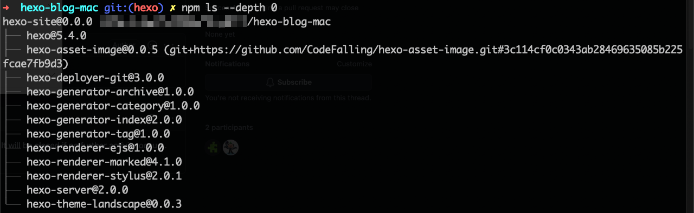

# 多平台协作发布注意事项

使用到的插件列表：




`.gitignore`文件中过滤了`node_modules\`，所以 clone 来的目录里没有`node_modules\`，这是hexo所需要的组件，所以要在该目录中重新安装hexo，**但不需要hexo init**。

```
npm install hexo
npm install
npm install hexo-deployer-git --save
```

尝试不过滤 .gitignore 的内容


参考链接：

[mac和windows协同写hexo博客)](https://wandouduoduo.github.io/articles/902dbefe.html)

